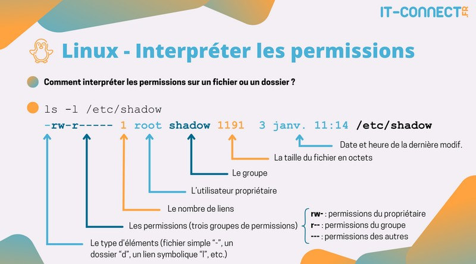

+++
title = "Les droits d'accès"
weight = 111
+++


Linux est un système multi-utilisateurs où **chaque fichier et dossier possède des permissions de sécurité**. Ces permissions protègent les fichiers contre les accès non autorisés et les erreurs. Elles permettent notamment :

- La **confidentialité** des données.
- La protection contre les **modifications accidentelles**.
- Le contrôle de **l’exécution** des fichiers

Sur Linux, il existe deux types de permissions : 
1. Les **permissions standards** et 
2. Les ***ACL*** (*Access Control Lists*). 

Nous étudierons uniquement les **permissions standards**, les plus utilisées.

## Afficher les permissions (commande *ls*)

Pour afficher les permissions d’un fichier ou d’un dossier, utilisez la commande `ls -l` :

```bash
$ ls -l
-rwxr-xr-x.  1 axel axel  1767 10 déc 16:52 script.sh
-rw-r--r--.  1 axel axel   343 27 mar 11:14 notes.txt
```

### Description des informations



Les permissions s’affichent sous la forme de **trois groupes de trois caractères** :
- **1er groupe (u)** : Permissions du **propriétaire** (*user*)
- **2e groupe (g)** : Permissions du **groupe propriétaire** (*group*)
- **3e groupe (o)** : Permissions des **autres utilisateurs** (*other*)

Chaque groupe contient **trois caractères** :
- **r** : Lecture (*Read*)
- **w** : Écriture (*Write*)
- **x** : Exécution (*eXecute*)

**Exemple** :
- `rwxr-xr-x` signifie que :
  - Le **propriétaire** peut **lire**, **écrire** et **exécuter** (`rwx`)
  - Le **groupe** peut **lire** et **exécuter** (`r-x`)
  - Les **autres** peuvent **lire** et **exécuter** (`r-x`)

## Modifier les permissions (commande *chmod*)

Seuls le **propriétaire** et ***root*** peuvent modifier les permissions avec la commande `chmod`.

### 1. Méthode symbolique

Cette méthode utilise les lettres et des symboles :
- `r`, `w`, `x` : droits de lecture, écriture et exécution
- `u`, `g`, `o`, `a` : utilisateur, groupe, autres, tous
- `+`, `-`, `=` : ajouter, retirer, définir

**Exemples** :
```bash
$ chmod u+x script.sh   # Ajoute le droit d'exécution au propriétaire
$ chmod o-w notes.txt   # Retire le droit d'écriture aux autres
$ chmod a+rwx fichier   # Accorde tous les droits à tous les utilisateurs
```

### 2. Méthode octale (numérique)

Chaque droit a une valeur numérique :
- `r = 4`, `w = 2`, `x = 1`

{}
Les valeurs numériques associées aux permissions Linux viennent de la représentation **binaire** des droits d'accès.
Chaque permission (lecture, écriture, exécution) correspond à un **bit** qui peut être activé (1) ou désactivé (0).  
 
1. En binaire, les droits sont représentés sur **3 bits** :  
   - Si le bit est à 1, le droit est accordé.  
   - Si le bit est à 0, le droit est refusé.  

2. Les 3 bits dans l'ordre **r  w  x**:  

| Permission  | Binaire   | Valeur décimale |
|:---------------:|:-------------:|:-------------------:|
|                 | **r  w  x**   |                     |
| **r (Read)**    |   1  0  0     | 4                   |
| **w (Write)**   |   0  1  0     | 2                   |
| **x (Execute)** |   0  0  1     | 1                   |  

3. Lorsqu’on combine plusieurs droits, on additionne les valeurs :  
   - **rw- (lecture + écriture)** = 110 en binaire → **4 + 2 = 6**  
   - **r-x (lecture + exécution)** = 101 en binaire → **4 + 1 = 5**  
   - **rwx (lecture + écriture + exécution)** = 111 en binaire → **4 + 2 + 1 = 7**  
{}

### Description des informations


**Exemples** :
```bash
$ chmod 755 script.sh  # Propriétaire : rwx, Groupe : r-x, Autres : r-x
$ chmod 644 notes.txt  # Propriétaire : rw-, Groupe : r--, Autres : r--
```

### Changer le propriétaire (commande *chown*)

Seul **root** peut changer le propriétaire d’un fichier avec `chown` :
```bash
$ chown user fichier            # Change le propriétaire
$ chown user:group fichier      # Change le propriétaire et le groupe
$ chown -R user repertoire      # Applique récursivement ((sous-dossiers et fichiers inclus) 
```

### Changer le groupe (commande *chgrp*)

Pour changer uniquement le groupe :
```bash
$ chgrp group fichier
$ chgrp -R group repertoire	# Applique récursivement (sous-dossiers et fichiers inclus) 
```

## Le droit d'exécution sous Linux

### **Rappel**: Spécifier l'interpréteur pour un script

Un script commence souvent par la ligne suivante :
```
#!/bin/bash
```
- `#!` indique au système d'utiliser l'interpréteur Bash.
- Ce mécanisme est appelé le "shebang".


### Qu'est-ce que le droit d'exécution ?

Le droit d'exécution permet :
- **Pour un fichier** : D'**exécuter** le fichier comme un programme ou un script.
- **Pour un répertoire** : De **parcourir** le contenu du répertoire, mais **sans pouvoir lister ses fichiers si le droit de lecture n'est pas accordé**.

Sur **Windows**, ce droit d'exécution joue un rôle similaire à l'extension ".exe".

### Pourquoi faut-il octroyer le droit d'exécution (même au propriétaire du fichier) 

Par défaut, quand on crée un fichier avec des commandes comme `touch`, `echo`, ou des **éditeurs de texte** (nano, vim, etc.), le fichier n'obtient généralement pas de droit d'exécution par défaut. Sans ce droit, un script ne pourra pas fonctionner.

### Donner la permission d'exécution (commande *chmod*)

```bash
$ chmod +x script.sh 
```
Cette commande donne le droit d'exécution à l'utilisateur **propriétaire**, au **groupe** et aux **autres**.
On peut ensuite exécuter le script **sans utiliser la commande `bash`**.

```bash
$ ./script.sh
```
- Le fichier doit être présent dans un dossier contenu dans la variable d’environnement `$PATH` pour être exécuté directement.
- `./` indique au système que le script se trouve dans le répertoire courant.

## La variable d'environnement $PATH

Le système **cherche les programmes exécutables** dans les répertoires listés dans la **variable d'environnement `$PATH`**.

### Afficher le contenu de $PATH

La variable d’environnement **$PATH** contient la liste des <u>répertoires dans lesquels le système cherche les **commandes exécutables**</u>.

```bash
$ echo $PATH
/home/user/.local/bin:/home/user/bin:/usr/local/bin:/usr/local/sbin:/usr/bin:/usr/sbin
```

- Chaque répertoire est séparé par un **deux-points** `:`.
- Quand on tape une commande, Linux va la chercher dans l’ordre des répertoires listés dans **$PATH**.

### Ajouter un répertoire au $PATH temporairement

```bash
$ export PATH=$PATH:/chemin/vers/repertoire
```

**Exemple** :
- Imaginons un script appelé **mon_script.sh** dans un dossier `/home/user/scripts`.
- Pour simplifier l’exécution du script sans spécifier le chemin complet, on ajoute `/home/user/scripts` au PATH :

```bash
$ export PATH=$PATH:/home/user/scripts
```

{}
- Cette modification n’est valable que pour la **session en cours**.
- Pour qu'elle soit permanent, ajoutez la ligne précédente à votre fichier `.bashrc` ou `.bash_profile`.
- Ainsi, le script s’exécutera correctement peu importe la méthode d’appel.
{}

---

## Exercices

1. Trouvez les permissions octales :
- `-w-r-----` ?
- `rw-r---w-` ?
- 755 en mode symbolique ?
- 426 en mode symbolique ?

{}
1. **Permissions octales :**  
   - `-w-r-----` :  
     - Propriétaire : **w** → 2  
     - Groupe : **r** → 4  
     - Autres : --- → 0  
     - **Valeur octale : 240**  
   
   - `rw-r---w-` :  
     - Propriétaire : **rw** → 4 + 2 = 6  
     - Groupe : **r** → 4  
     - Autres : **w** → 2  
     - **Valeur octale : 642**  

2. **Permissions symboliques :**  
   - `755` en mode symbolique :  
     - Propriétaire : **rwx** → 4 + 2 + 1 = 7  
     - Groupe : **r-x** → 4 + 1 = 5  
     - Autres : **r-x** → 4 + 1 = 5  
     - **Valeur symbolique : rwxr-xr-x**  

   - `426` en mode symbolique :  
     - Propriétaire : **r--** → 4  
     - Groupe : **-w-** → 2  
     - Autres : **rw-** → 4 + 2 = 6  
     - **Valeur symbolique : r-- -w- rw-**  

{}

2. Tests de permissions :
Créez cette structure :
```
Cours11
├── fic1.txt
└── rep1
    └── fic2.txt
```

{}
**Création de la structure de dossiers :**
```bash
mkdir -p Cours11/rep1
touch Cours11/fic1.txt Cours11/rep1/fic2.txt
```
{}

En faisant varier les droits (pour l’**utilisateur propriétaire**) sur le répertoire **rep1** et sur le fichier **fic1.txt**, essayez les commandes comme `touch`, `cd`, `ls` sur le répertoire **rep1** et `cat` ou ajout de texte sur les fichiers à l’intérieur (**fic1.txt** et **fic2.txt**).

### Concernant le répertoire rep1

| Action | r | w | x | rw | wx | rx |
|---------|---|---|---|----|----|----|
| Afficher le contenu (`ls`) |   |   |   |    |    |    |
| Créer un fichier (`touch`) |   |   |   |    |    |    |
| Traverser le répertoire (`cd`) |   |   |   |    |    |    |


{}
**Concernant le répertoire `rep1`**  

| **Action**                                | **r** | **w** | **x** | **rw** | **wx** | **rx** |
|-------------------------------------------|-------|-------|-------|--------|--------|--------|
| Afficher le contenu (`ls`)                | ✅    | ❌    | ✅    | ✅     | ❌     | ✅     |
| Créer un fichier (`touch`)                | ❌    | ✅    | ✅    | ✅     | ✅     | ❌     |
| Traverser le répertoire (`cd`)            | ❌    | ❌    | ✅    | ✅     | ✅     | ✅     |

**Explications :**  
- `r` (lecture) permet de lister le contenu du dossier si le droit `x` (exécution) est aussi présent.  
- `w` (écriture) permet de créer, supprimer ou renommer des fichiers, mais seulement si le droit `x` (exécution) est aussi présent.  
- `x` (exécution) permet de "traverser" le dossier (utiliser `cd` ou accéder aux fichiers à l'intérieur).  
{}


### Concernant le fichier fic1.txt

| Action | r | w | x | rw | wx | rx |
|---------|---|---|---|----|----|----|
| Afficher le contenu (`cat`) |   |   |   |    |    |    |
| Ajouter du texte (`echo "texte" >> fic1.txt`)|   |   |   |    |    |    |


{}
**Concernant le fichier `fic1.txt`**  

| **Action**                                | **r** | **w** | **x** | **rw** | **wx** | **rx** |
|-------------------------------------------|-------|-------|-------|--------|--------|--------|
| Afficher le contenu (`cat`)               | ✅    | ❌    | ❌    | ✅     | ❌     | ❌     |
| Ajouter du texte (`echo "texte" >> fic1.txt`) | ❌    | ✅    | ❌    | ✅     | ✅     | ❌     |

**Explications :**  
- `r` (lecture) permet d'afficher le contenu.  
- `w` (écriture) permet de modifier le contenu.  
- `x` (exécution) sur un fichier texte ne sert généralement à rien, sauf pour les scripts exécutables.  
{}


### Concernant le fichier fic2.txt et les permissions de rep1

| **Action**                                | **r** | **w** | **x** | **rw** | **wx** | **rx** |
|-------------------------------------------|-------|-------|-------|--------|--------|--------|
| Voir le fichier (`ls rep1`)               |     |     |    |      |      |     |
| Afficher le contenu (`cat rep1/fic2.txt`) |     |     |     |      |      |      |
| Ajouter du texte (`echo "texte" >> fic2.txt`) |     |     |     |      |      |      |


{}
**Concernant le fichier `fic2.txt` et les permissions de `rep1`**  

| **Action**                                | **r** | **w** | **x** | **rw** | **wx** | **rx** |
|-------------------------------------------|-------|-------|-------|--------|--------|--------|
| Voir le fichier (`ls rep1`)               | ✅    | ❌    | ✅    | ✅     | ❌     | ✅     |
| Afficher le contenu (`cat rep1/fic2.txt`) | ✅    | ❌    | ✅    | ✅     | ❌     | ✅     |
| Ajouter du texte (`echo "texte" >> fic2.txt`) | ❌    | ✅    | ✅    | ✅     | ✅     | ❌     |

**Explications :**  
- Si le dossier `rep1` n’a pas le droit d’exécution (`x`), il est impossible d'y accéder, même si on a les droits de lecture.  
- Pour ajouter du texte à `fic2.txt`, il faut que le dossier parent `rep1` ait le droit d'exécution (`x`) et le fichier le droit d'écriture (`w`). 
{}


