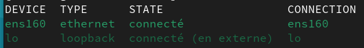
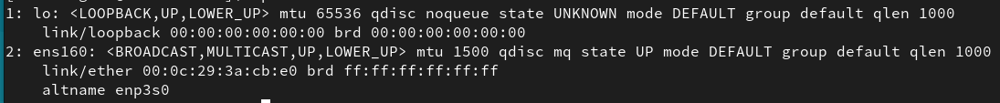
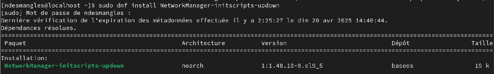

+++
title = "Le réseau sous Linux"
weight = 121
+++


## Introduction

Configurer un réseau sous Linux se fait à l’aide de commandes et de fichiers texte.

Dans le cours [7 - vim et fichiers de configuration](https://linuxh25.netlify.app/semaine7/), nous avons vu comment modifier ces fichiers.  
Dans ce cours-ci, nous allons explorer des **commandes réseau essentielles**.

## Rappel : les fichiers texte importants niveau réseau

Voici deux fichiers que nous avons déjà vus :

- **`/etc/hosts`** : permet une **résolution de noms simple** (utile si un serveur DNS n’est pas disponible).
- **`/etc/resolv.conf`** : contient la **liste des serveurs DNS** utilisés par la machine.

## Les commandes réseau: ***nmcli*** et ***ip***

- Le nom `nmcli` est pour ***NetworkManager Command Line Interface***.
- `nmcli` est un outil en ligne de commande pour interagir avec NetworkManager. Il permet de **configurer des connexions réseau** sans passer par des fichiers manuels.

- La commande `ip` remplace `ifconfig`, qui est maintenant **obsolète**.  
- La commande `ip` permet de **lire et modifier temporairement** la configuration IP d’une interface.

{}
Les changements faits avec `ip` **ne sont pas permanents**. Ils seront perdus après un redémarrage du système.
{}

## Différence entre interface et connexion

C'est important de ne pas confondre **interface réseau** (ex. ens160) et la **connexion** (ex. statique ou dynamique) créée avec nmcli.
  - Interface = matériel (ex. `ens160`)
  - Connexion = configuration liée (ex. `statique` ou `dynamique`)

Avant de configurer un réseau, c'est recommandé de connaitre les interfaces disponibles sur le système.

## Vérifier les interfaces disponibles

```bash
$ nmcli device status
# ou plus court :
$ nmcli dev
```



Ou

```bash
$ ip link show
```


## Créer une connexion Ethernet statique (fixe)

- Cela consiste à donner une **adresse IP fixe**, une **passerelle**, **des DNS** à l'interface, puis redémarrer la connexion pour appliquer le tout.   

**Exemple** : configurer l’interface `ens160` avec une adresse IP statique.

```bash
# Ajouter une nouvelle connexion réseau Ethernet <nom_connexion>, liée à l’interface réseau physique <interface>.
$ nmcli con add con-name <nom_connexion> type ethernet ifname <interface>

# Donner une adresse IP à l’interface
$ nmcli con mod <nom_connexion> ipv4.addresses 192.168.230.132/24

# Définir la passerelle (gateway)
$ nmcli con mod <nom_connexion> ipv4.gateway 192.168.230.2

# Configurer les serveurs DNS pour résoudre les noms de domaine
$ nmcli con mod <nom_connexion> ipv4.dns 8.8.8.8

# Préciser que la configuration est manuelle
$ nmcli con mod <nom_connexion> ipv4.method manual

# Redémarrer la connexion
$ nmcli con up <nom_connexion>
```

{}
- L’adresse IP 192.168.230.132 avec un masque /24 équivaut à un masque de 255.255.255.0.
  - Le /24 indique que les 24 premiers bits de l'adresse servent à identifier le réseau.
- La passerelle est l’adresse du routeur à utiliser pour sortir du réseau.
- Par soucis de simplicité, on nomme la connexion avec le nom de l'interface.
  - Dans l'exemple, cela veut dire qu'on remplacerai **<nom_connexion>** par `ens160`.
{}

## Gérer les connexions

   ##### Lister les connexions enregistrées
   ```bash
   $ nmcli con show
   ```

   ##### Lister les connexions actives
   ```bash
   $ nmcli con show --active
   ```

   ##### Détails d’une connexion
   ```bash
   $ nmcli con show <nom_connexion>
   ```

   ##### Activer une connexion spécifique
   ```bash
   $ nmcli con up <nom_connexion>
   ```

   ##### Désactiver une connexion
   ```bash
   $ nmcli con down <nom_connexion>
   ```

   ##### Supprimer une connexion
   ```bash
   $ nmcli con delete <nom_connexion>
   ```

## Créer une connexion Ethernet dynamique (via *DHCP*)

Cela consiste à effacer les réglages manuels (IP, DNS, passerelle), puis redémarrer la connexion.

```bash
# Configurer l'interface pour obtenir automatiquement une adresse IP
$ nmcli con mod <interface> ipv4.method auto

# Effacer les DNS manuels
$ nmcli con mod <interface> ipv4.dns ""

# Supprimer toute adresse IP fixe et passerelle manuelle
$ nmcli con mod <interface> ipv4.gateway "" ipv4.addresses ""

# Désactiver temporairement la connexion
$ nmcli con down <nom_connexion>

# Réactiver la connexion, avec la nouvelle configuration.
$ nmcli con up <nom_connexion>
```

{}
Parfois il faut répéter la commande précédente (`nmcli con up`) pour s'assurer que la connexion remonte bien.
{}

## Activer/Désactiver le réseau

   ##### Activer le réseau géré par *NetworkManager*
   ```bash
   $ nmcli networking on
   ```

   ##### Désactiver tout le réseau
   ```bash
   $ nmcli networking off
   ```

## La commande ***ip***

   ##### Afficher la configuration IP réseau
   ```bash
   $ ip address
   # ou plus court :
   $ ip a   # a pour adresse
   ```

   ##### Afficher la configuration ip d'une seule interface
   ```bash
   $ ip a show <interface>
   ```

   ##### Ajouter plusieurs adresses IP sur une même interface (**même sous-réseau obligatoire**)

   {}
   L'interface doit exister et avoir une connexion active au réseau avant d'y ajouter une adresse IP.
   {}

   ```bash
   $ sudo ip addr add 192.168.230.132/24 dev ens33
   ```

   ##### Supprimer une adresse IP
   ```bash
   $ sudo ip addr del 192.168.230.132/24 dev ens33
   ```

   ##### Ajouter une passerelle par défaut
   ```bash
   $ sudo ip route add default via 192.168.230.2
  ```

   ##### Voir la table de routage
   ```bash
   $ ip route
   ```

## Commandes obsolètes ou anciennes

### La commande ***ifconfig***

{}
- La commande `ifconfig` est plus ancienne et tend à disparaître, mais reste parfois utile.
- C'est un utilitaire de configuration de réseau.

**Afficher la liste des interfaces réseau et de la configuration**
```bash
$ ifconfig
```

**Voir une interface en particulier**
```bash
$ ifconfig <interface>
```

**Activer/désactiver une interface**
```bash
$ ifconfig <interface> up
$ ifconfig <interface> down
```

**Attribuer une adresse IP (temporairement)**
```bash
$ ifconfig ens33 10.0.2.34 netmask 255.255.224.0
```

**Ajouter une adresse IP secondaire (alias)**
```bash
$ ifconfig ens33:1 10.0.2.56 netmask 255.255.255.0
```

> L’interface alias (`ens33:1`) utilise la même carte réseau (donc la même adresse MAC) et doit être dans le **même sous-réseau**.

## Désactiver un alias
```bash
$ ifconfig ens33:1 down
```
{}


### Les commandes ***ifdown*** et ***ifup***

- si votre machine Linux ne connait pas ces commandes, vous devez les installer à l'aide de la commande `dnf`.



{}


## Redémarrer (désactivation et réactivation) une interface réseau

**1. Désactivation: perte de connexion réseau**
```bash
$ ifdown ens160
```

**2. Réactivation: retour de l'accès réseau**
```bash
$ ifup ens160
```
{}

---

## Exercice 1

Remplissez le tableau avec les paramètres actuels de votre machine :

| Adresse IP | Masque de sous-réseau | Passerelle par défaut | DNS1 | DNS2 |
|:----------:|:---------------------:|:----------------------:|:----:|:----:|
|            |                       |                        |      |      |

1. Votre adresse IP est-elle **statique** ou **dynamique (DHCP)** ?
2. Modifiez le bon fichier de configuration pour attribuer une **adresse IP statique**.
3. Redémarrez le service réseau et testez l'accès à Internet.
4. Revenez à une configuration en DHCP.
5. Testez à nouveau la connexion.

{}

### Étape 1 : Remplir le tableau

Utiliser les commandes suivantes pour obtenir les paramètres actuels :

```bash
$ ip a            # pour l’adresse IP et le masque
$ ip route        # pour la passerelle par défaut
$ cat /etc/resolv.conf  # pour les serveurs DNS
```

#### Exemple de réponse (vos données peuvent être différentes):

| Adresse IP       | Masque de sous-réseau | Passerelle par défaut | DNS1       | DNS2       |
|:----------------:|:---------------------:|:----------------------:|:----------:|:----------:|
| 192.168.230.100  | 255.255.255.0         | 192.168.230.2          | 8.8.8.8    | 8.8.4.4    |

### Étape 2 : Vérifier si l’adresse est dynamique (DHCP) ou statique

Utiliser cette commande :

```bash
$ nmcli con show ens160 | grep ipv4.method
```

- Si la méthode est `auto` → **DHCP**  
- Si la méthode est `manual` → **statique**


### Étape 3 : Attribuer une adresse IP statique

Modifier la configuration avec `nmcli` :

```bash
$ nmcli con mod ens160 ipv4.address 192.168.230.100/24
$ nmcli con mod ens160 ipv4.gateway 192.168.230.2
$ nmcli con mod ens160 ipv4.dns 8.8.8.8,8.8.4.4
$ nmcli con mod ens160 ipv4.method manual
$ nmcli con down ens160
$ nmcli con up ens160
```

### Étape 4 : Vérifier l'accès à Internet

Tester avec une commande comme :

```bash
$ ping google.com
```

### Étape 5 : Revenir à une configuration en DHCP

```bash
$ nmcli con mod ens160 ipv4.method auto
$ nmcli con mod ens160 ipv4.address ""
$ nmcli con mod ens160 ipv4.gateway ""
$ nmcli con mod ens160 ipv4.dns ""
$ nmcli con down ens160
$ nmcli con up ens160
```

### Étape 6 : Vérifier que tout fonctionne

Refaire un test :

```bash
$ ping google.com
```

Si tout fonctionne, la configuration est correcte.

{}

## Exercice 2

1. Ajoutez **deux adresses IP supplémentaires** à votre interface avec la commande `ip`.  
   → Vous devez avoir **trois adresses IP différentes**.
 
   {}
   Toutes les adresses doivent être dans le **même réseau**.
   {}

2. Modifiez le fichier `hosts` pour associer **un nom différent à chaque adresse** (pour que les trois répondent à un ping).

3. Redémarrez le service réseau.  
   Est-ce que les adresses IP sont toujours là ?

4. Comment rendre ces adresses **persistantes** ?  
   (Trouvez la réponse en théorie, ou testez si vous le souhaitez.)


{}

### Étape 1 : Ajouter deux adresses IP à l’interface (temporairement)

On suppose que l’interface est `ens33`.  
Adaptez selon le nom de votre interface (`ip a` pour le voir).

```bash
$ sudo ip addr add 192.168.230.101/24 dev ens33
$ sudo ip addr add 192.168.230.102/24 dev ens33
```

Vous devriez maintenant avoir **trois adresses IP** sur `ens33` :

```bash
$ ip a show ens33
```


### Étape 2 : Modifier le fichier */etc/hosts*

Ouvrir le fichier avec des droits root :

```bash
$ sudo vim /etc/hosts
```

Ajouter ces lignes à la fin du fichier :

```
192.168.230.100  machine-principale
192.168.230.101  alias-un
192.168.230.102  alias-deux
```

Enregistrez et quittez (`:wq`).


### Étape 3 : Tester avec des ping

```bash
$ ping machine-principale
$ ping alias-un
$ ping alias-deux
```

Chaque nom devrait répondre correctement.

### Étape 4 : Redémarrer le service réseau

```bash
$ sudo nmcli networking off
$ sudo nmcli networking on
```

#### Question : est-ce que les IP supplémentaires sont encore là ?

```bash
$ ip a show ens33
```

**Réponse :** Non, elles ont disparu.  
- Les IP ajoutées avec `ip addr add` sont **temporaires**.


### Étape 5 : Comment rendre ces IP **persistantes** ?

Deux façons possibles :

#### **Méthode 1 : via *nmcli***

Ajouter plusieurs adresses IP dans la configuration de l’interface :

```bash
$ sudo nmcli con mod ens33 +ipv4.addresses 192.168.230.101/24
$ sudo nmcli con mod ens33 +ipv4.addresses 192.168.230.102/24
$ sudo nmcli con mod ens33 ipv4.method manual
$ sudo nmcli con mod ens33 ipv4.gateway 192.168.230.2
$ sudo nmcli con mod ens33 ipv4.dns 8.8.8.8,8.8.4.4
$ sudo nmcli con down ens33
$ sudo nmcli con up ens33
```

#### **Méthode 2 : en modifiant les fichiers manuellement**
> À faire seulement si vous êtes à l’aise avec les fichiers de configuration réseau, par exemple `/etc/sysconfig/network-scripts/ifcfg-ens33` (selon la distribution).

{}

---
## Erreurs courantes

### 1. Erreur : *`Cannot find device "ens33"`*
- **Cause :** Interface réseau inexistante.
- **Solution :**
    - Vérifier l'existence de l'inerface
    - La créer le cas échéant avec `nmcli con add`
  ```bash
  $ nmcli device status
  ```

### 2. Erreur : *`Nexthop has invalid gateway`*
- **Cause :** Mauvaise passerelle ou interface inactive.
- **Solution :**
  - Vérifier que l’IP est dans le bon sous-réseau.
  - Activer l’interface :
    ```bash
    $ sudo ip link set <nom_interface> up
    ```

### 3. Interface invalide dans *nmcli con add*
- **Cause :** Mauvais nom d’interface.
- **Solution**
  ```bash
  $ nmcli device status
  ```

### 4. IP ajoutée à une interface inactive
- **Solution**
  ```bash
  sudo ip link set <interface> up
  ```


## Bonnes pratiques

- Toujours vérifier le vrai nom de l’interface réseau avant de créer une configuration..
- Supprimer les connexions en double ou inutiles.
