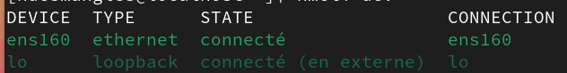
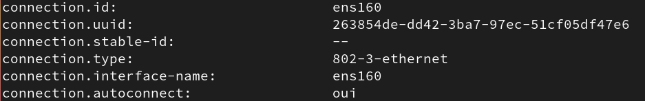
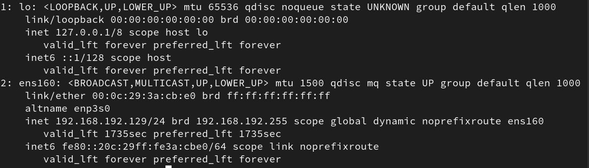
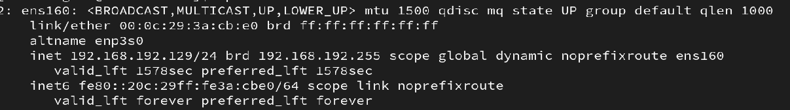
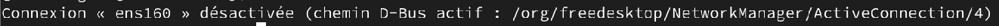
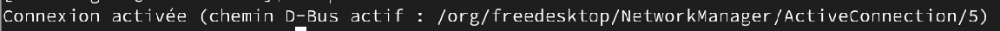

+++
title = "Le réseau sous Linux"
weight = 121
+++


## Introduction

Configurer un réseau sous Linux se fait à l’aide de commandes et de fichiers texte.

Dans le cours [7 - vim et fichiers de configuration](https://linuxh25.netlify.app/semaine7/), nous avons vu comment modifier ces fichiers.  
Dans ce cours-ci, nous allons explorer des **commandes réseau essentielles**.


## Rappel : les fichiers texte importants niveau réseau

Voici deux fichiers que nous avons déjà vus :

- **`/etc/hosts`** : permet une **résolution de noms simple** (utile si un serveur DNS n’est pas disponible).
- **`/etc/resolv.conf`** : contient la **liste des serveurs DNS** utilisés par la machine.


## Les commandes réseau

### A. La commande *nmcli*

- Le nom `nmcli` est pour ***NetworkManager Command Line Interface***.
- La commande `nmcli` sert à **gérer les interfaces réseau**. On l'utilise pour: 
	- Afficher, créer, supprimer, modifier, activer et désactiver les **connexions réseau** et 
	- Contrôler et afficher **l'état des périphériques réseau**.

#### 1. **Lister les connexions réseau**
```bash
$ nmcli dev
```


#### 2. **Afficher la configuration réseau de l'interface ens160**
```bash
$ nmcli con show ens160
```


#### 3. **Configurer manuellement une adresse IP statique**

Cela consiste à donner une **adresse IP fixe**, une **passerelle**, **des DNS** à `ens160`, puis redémarrer la connexion pour appliquer le tout. Voici les commandes à faire dans l'ordre:  

##### 3.1 Donner une adresse IP à l’interface ***ens160***
```bash
$ nmcli con mod ens160 ipv4.address 192.168.230.10/24
```
➡️ L’adresse IP **192.168.230.10** avec un masque **/24** équivaut à 255.255.255.0


##### 3.2 Définir la **passerelle** (gateway) 
```bash
$ nmcli con mod ens160 ipv4.gateway 192.168.230.2
```
➡️  La passerelle est **l’adresse du routeur** à utiliser pour sortir du réseau.

##### 3.3 Configurer les **serveurs DNS** pour résoudre les noms de domaine
```bash
$ nmcli con mod ens160 ipv4.dns 8.8.8.8,8.8.4.4
```
➡️ Ici les serveurs DNS sont ceux de Google.

##### 3.4 Préciser que la configuration est manuelle
```bash
$ nmcli con mod ens160 ipv4.method manual
```
➡️ **manuelle** = **pas** automatique via DHCP.

##### 3.5 Redémarrer la connexion

```bash
$ nmcli con down ens160
```
➡️ Désactive temporairement la connexion.


##### 3.6 Réactiver la connexion

```bash
$ nmcli con up ens160
```
➡️ Réactive la connexion avec les **nouveaux paramètres** appliqués.


#### 4. **Revenir à une adresse IP dynamique (DHCP)**

Les commandes suivantes **remettent ens160 en configuration automatique (DHCP)**, effacent les réglages manuels (IP, DNS, passerelle), puis redémarrent la connexion.

##### 4.1. Configurer **ens160** pour obtenir automatiquement une adresse IP (via DHCP)
```bash 
$ nmcli con mod ens160 ipv4.method auto
```

##### 4.2. Effacer les **DNS manuels** ().
```bash 
$ nmcli con mod ens160 ipv4.dns ""
```
👉 pour que les DNS du DHCP soient utilisés

##### 4.3. Supprimer toute **adresse IP fixe** et **passerelle** manuelle.
```bash 
$ nmcli con mod ens160 ipv4.gateway "" ipv4.addresses ""
```

##### 4.4. Désactiver temporairement la connexion **ens160**
```bash 
$ nmcli con down ens160
```

##### 4.5. Réactiver la connexion **ens160**, avec la nouvelle configuration.
```bash
$ nmcli con up ens160
```

{}
Parfois il faut répéter la commande précédente (**#4.5**) pour s'assurer que la connexion remonte bien.
{}


#### 5. **Ajouter une nouvelle connexion (interface) réseau**

Il peut arriver de devoir ajouter une nouvelle connexion réseau. Voici quelques situations possibles:
- Ajout d'une nouvelle carte réseau sur une machine.
- Une interface réseau existante, mais aucune connexion active ou enregistrée pour elle.
- Nécessité d'une adresse IP statique, un DNS, etc.
- En cas d'erreur, nettoyage ou remplacement d'une configuration.

Voici un exemple de comment ajouter **une nouvelle connexion réseau Ethernet** appelée **ens224**, liée à l'interface réseau physique **ens224**.

```bash
$ nmcli con add con-name ens224 type ethernet ifname ens224
```


Ensuite, on peut lui attribuer une IP fixe ou utiliser le DHCP.

#### 6. **Le service réseau**

Sous Linux, il faut parfois **redémarrer le service réseau** pour que les changements soient pris en compte.

##### 6.1. Désactiver le service
```bash
$ nmcli networking off
```

#### 6.2. Réactiver le service
```bash
$ nmcli networking on
```


### B. La commande ***ip***

- La commande `ip` remplace `ifconfig`, qui est maintenant **obsolète**.  
- La commande `ip` permet de **lire et modifier temporairement** la configuration IP d’une interface.

{}
Les changements faits avec `ip` **ne sont pas permanents**. Ils seront perdus après un redémarrage du système.
{}

#### 1. **Afficher la configuration IP réseau**
```bash
$ ip address
# ou plus court :
$ ip a   # a pour adresse
```



#### 2. **Afficher la configuration ip d'une seule interface**
```bash
$ ip a show <interface>
```
**Exemple avec l'interface ens160**



<!--
-->

#### 3. Ajouter plusieurs adresses IP sur une même interface (**même sous-réseau obligatoire**)

> Attention: l'interface doit exister et avoir une connexion active au réseau avant d'y ajouter une adresse IP.
**Ajout**: nmcli con add con-name ens33 type ethernet ifname ens33

```bash
$ sudo ip addr add 192.168.230.132/24 dev ens33
```

#### 4. Supprimer une adresse IP
```bash
$ sudo ip addr del 192.168.230.132/24 dev ens33
```

#### 5. Ajouter une passerelle par défaut
```bash
$ sudo ip route add default via 192.168.230.2
```

#### Voir la table de routage
```bash
$ ip route
```

## C. Commandes obsolètes ou anciennes

### La commande ***ifconfig***

{}
- La commande `ifconfig` est plus ancienne et tend à disparaître, mais reste parfois utile.
- C'est un utilitaire de configuration de réseau.

**Afficher la liste des interfaces réseau et de la configuration**
```bash
$ ifconfig
```

**Voir une interface en particulier**
```bash
$ ifconfig <interface>
```

**Activer/désactiver une interface**
```bash
$ ifconfig <interface> up
$ ifconfig <interface> down
```

**Attribuer une adresse IP (temporairement)**
```bash
$ ifconfig ens33 10.0.2.34 netmask 255.255.224.0
```

**Ajouter une adresse IP secondaire (alias)**
```bash
$ ifconfig ens33:1 10.0.2.56 netmask 255.255.255.0
```

> L’interface alias (`ens33:1`) utilise la même carte réseau (donc la même adresse MAC) et doit être dans le **même sous-réseau**.

## Désactiver un alias
```bash
$ ifconfig ens33:1 down
```
{}


### Les commandes ***ifdown*** et ***ifup***

{}

## Redémarrer (désactivation et réactivation) une interface réseau

**1. Désactivation: perte de connexion réseau**
```bash
$ ifdown ens160
```



**2. Réactivation: retour de l'accès réseau**
```bash
$ ifup ens160
```


{}

---

## Exercice 1

Remplissez le tableau avec les paramètres actuels de votre machine :

| Adresse IP | Masque de sous-réseau | Passerelle par défaut | DNS1 | DNS2 |
|:----------:|:---------------------:|:----------------------:|:----:|:----:|
|            |                       |                        |      |      |

1. Votre adresse IP est-elle **statique** ou **dynamique (DHCP)** ?
2. Modifiez le bon fichier de configuration pour attribuer une **adresse IP statique**.
3. Redémarrez le service réseau et testez l'accès à Internet.
4. Revenez à une configuration en DHCP.
5. Testez à nouveau la connexion.

{}

### Étape 1 : Remplir le tableau

Utiliser les commandes suivantes pour obtenir les paramètres actuels :

```bash
$ ip a            # pour l’adresse IP et le masque
$ ip route        # pour la passerelle par défaut
$ cat /etc/resolv.conf  # pour les serveurs DNS
```

#### Exemple de réponse (vos données peuvent être différentes):

| Adresse IP       | Masque de sous-réseau | Passerelle par défaut | DNS1       | DNS2       |
|:----------------:|:---------------------:|:----------------------:|:----------:|:----------:|
| 192.168.230.100  | 255.255.255.0         | 192.168.230.2          | 8.8.8.8    | 8.8.4.4    |


### Étape 2 : Vérifier si l’adresse est dynamique (DHCP) ou statique

Utiliser cette commande :

```bash
$ nmcli con show ens160 | grep ipv4.method
```

- Si la méthode est `auto` → **DHCP**  
- Si la méthode est `manual` → **statique**


### Étape 3 : Attribuer une adresse IP statique

Modifier la configuration avec `nmcli` :

```bash
$ nmcli con mod ens160 ipv4.address 192.168.230.100/24
$ nmcli con mod ens160 ipv4.gateway 192.168.230.2
$ nmcli con mod ens160 ipv4.dns 8.8.8.8,8.8.4.4
$ nmcli con mod ens160 ipv4.method manual
$ nmcli con down ens160
$ nmcli con up ens160
```

### Étape 4 : Vérifier l'accès à Internet

Tester avec une commande comme :

```bash
$ ping google.com
```


### Étape 5 : Revenir à une configuration en DHCP

```bash
$ nmcli con mod ens160 ipv4.method auto
$ nmcli con mod ens160 ipv4.address ""
$ nmcli con mod ens160 ipv4.gateway ""
$ nmcli con mod ens160 ipv4.dns ""
$ nmcli con down ens160
$ nmcli con up ens160
```

### Étape 6 : Vérifier que tout fonctionne

Refaire un test :

```bash
$ ping google.com
```

Si tout fonctionne, la configuration est correcte.

{}

## Exercice 2

1. Ajoutez **deux adresses IP supplémentaires** à votre interface avec la commande `ip`.  
   → Vous devez avoir **trois adresses IP différentes**.
 
   {}
   Toutes les adresses doivent être dans le **même réseau**.
   {}

2. Modifiez le fichier `hosts` pour associer **un nom différent à chaque adresse** (pour que les trois répondent à un ping).

3. Redémarrez le service réseau.  
   Est-ce que les adresses IP sont toujours là ?

4. Comment rendre ces adresses **persistantes** ?  
   (Trouvez la réponse en théorie, ou testez si vous le souhaitez.)


{}

### Étape 1 : Ajouter deux adresses IP à l’interface (temporairement)

On suppose que l’interface est `ens33`.  
Adaptez selon le nom de votre interface (`ip a` pour le voir).

```bash
$ sudo ip addr add 192.168.230.101/24 dev ens33
$ sudo ip addr add 192.168.230.102/24 dev ens33
```

Vous devriez maintenant avoir **trois adresses IP** sur `ens33` :

```bash
$ ip a show ens33
```


### Étape 2 : Modifier le fichier */etc/hosts*

Ouvrir le fichier avec des droits root :

```bash
$ sudo nano /etc/hosts
```

Ajouter ces lignes à la fin du fichier :

```
192.168.230.100  machine-principale
192.168.230.101  alias-un
192.168.230.102  alias-deux
```

Enregistrez (Ctrl + O, puis Entrée) et quittez (Ctrl + X).


### Étape 3 : Tester avec des ping

```bash
$ ping machine-principale
$ ping alias-un
$ ping alias-deux
```

Chaque nom devrait répondre correctement.

### Étape 4 : Redémarrer le service réseau

```bash
$ sudo nmcli networking off
$ sudo nmcli networking on
```

#### Question : est-ce que les IP supplémentaires sont encore là ?

```bash
$ ip a show ens33
```

**Réponse :** Non, elles ont disparu.  
- Les IP ajoutées avec `ip addr add` sont **temporaires**.


### Étape 5 : Comment rendre ces IP **persistantes** ?

Deux façons possibles :

#### **Méthode 1 : via *nmcli***

Ajouter plusieurs adresses IP dans la configuration de l’interface :

```bash
$ sudo nmcli con mod ens33 +ipv4.addresses 192.168.230.101/24
$ sudo nmcli con mod ens33 +ipv4.addresses 192.168.230.102/24
$ sudo nmcli con mod ens33 ipv4.method manual
$ sudo nmcli con mod ens33 ipv4.gateway 192.168.230.2
$ sudo nmcli con mod ens33 ipv4.dns 8.8.8.8,8.8.4.4
$ sudo nmcli con down ens33
$ sudo nmcli con up ens33
```

#### **Méthode 2 : en modifiant les fichiers manuellement**
> À faire seulement si vous êtes à l’aise avec les fichiers de configuration réseau, par exemple `/etc/sysconfig/network-scripts/ifcfg-ens33` (selon la distribution).

{}
