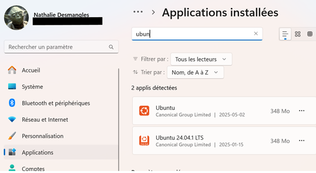

+++
title = "Introduction à WSL (Windows Subsystem for Linux)"
weight = 141
+++

## Qu’est-ce que WSL ?

WSL, ou *Windows Subsystem for Linux*, est une fonctionnalité de Windows qui vous permet d’utiliser un environnement GNU/Linux directement à partir de Windows, **sans machine virtuelle**. Vous pouvez exécuter des commandes, des outils et des scripts Linux avec des performances proches de celles d’un système natif.


## Pourquoi utiliser WSL ?

Voici quelques bonnes raisons d’utiliser WSL dans votre parcours d’informaticien·ne :

- **Développement croisé** : vous pouvez développer vos projets sous Windows tout en testant votre code dans un environnement Linux.
- **Interopérabilité** : vous avez un accès facile et bidirectionnel aux fichiers Windows et Linux.
- **Simplicité** : les distributions Linux (comme Ubuntu) s’installent en quelques clics depuis le Microsoft Store.
- **Performance** : WSL 2 est rapide et compatible avec la plupart des outils Linux modernes.


## WSL 1 ou WSL 2 ?  

Voici un tableau comparatif pour bien comprendre les deux versions :

| **WSL 1** | **WSL 2** |
|----------|-----------|
| Traduit les appels Linux vers Windows | Utilise un véritable noyau Linux dans une VM légère |
| Meilleur pour accéder aux fichiers Windows rapidement | Meilleure compatibilité avec les outils et paquets Linux |

{}
- Pour le développement Web ou logiciel, on recommande **WSL 2**.
- Les commandes ci-dessous se font dans ***PowerShell***.

**Pour connaitre la version installée :**
```powershell
$ wsl -l -v
NAME            STATE           VERSION
* Ubuntu-24.04    Stopped         1
  Ubuntu          Running         1
```
**Vous pouvez la mettre à jour avec :**
```powershell
$ wsl --update
```
**WSL n'est pas déjà installé, vous pouvez le faire avec :**
```powershell
$ wsl --install
```
Cette commande :
 - Active les fonctionnalités requises
 - Installe WSL 2
 - Installe Ubuntu par défaut
{}

## Commandes utiles

Voici une commande de base à connaître :

| Commande | Description |
|----------|-------------|
| `wsl` | Lance votre distribution Linux par défaut dans le répertoire courant de Windows (si possible) |


Ouvrir votre terminal PowerShell et tapez `wsl`. Notez ce qui se passe.
```PowerShell
wsl
````

## Accès aux fichiers

### 1. Depuis Linux vers les fichiers Windows

Les disques Windows sont accessibles via le dossier `/mnt`.

Exemple :  
```bash
$ cd /mnt/c/Users/VotreNom/Documents
$ ls
```

> Essayez-le dans votre terminal WSL. Vous devriez voir vos fichiers Windows.


### 2. **Depuis Windows vers les fichiers Linux :**

Dans l’explorateur de fichiers Windows, entrez l’adresse suivante dans la barre d’adresse :

```
\\wsl$
```

Vous verrez les fichiers de vos distributions Linux installées.

## Scénario : créer un projet Node.js dans WSL

Faites les étapes suivantes dans le terminal WSL :

```bash
$ sudo apt update
$ sudo apt install nodejs npm
$ mkdir projet-node
$ cd projet-node
$ npm init -y
```

> **Objectif** : Installer Node.js et créer un projet vide.

{}
Sous Ubuntu, la commande `apt` est utilisée pour installer des logiciels. Sur d'autres distributions comme Fedora, on utiliserait plutôt `dnf`.
{} 


## Éditez votre projet avec Visual Studio Code

Dans le terminal WSL, à l’intérieur du dossier `projet-node`, tapez :

```bash
$ code .
```

Cela ouvrira le projet dans VS Code.

Créez ensuite un fichier nommé `app.js` avec le contenu suivant :

```javascript
// app.js
const http = require('http');
http.createServer((req, res) => {
  res.end("Bonjour du serveur Node.js dans WSL!");
}).listen(3000);
```

Lancez votre serveur :

```bash
$ node app.js
```

Ouvrez ensuite un navigateur sous Windows et entrez cette adresse :

```
http://localhost:3000
```

> Vous venez de lancer un serveur Node.js dans un environnement Linux, tout en restant sur Windows !

## Conclusion

WSL vous permet de combiner :

- la **puissance de Linux** pour les outils de développement;
- et la **simplicité de Windows** pour l’édition de code et la gestion de fichiers.

## Désinstaller WSL, nodejs et npm


### 1. Désinstaller WSL (Windows Subsystem for Linux)

#### a) Désinstaller une distribution Linux (ex. : Ubuntu-24.04)

Dans PowerShell (en tant qu’administrateur si possible), tape :

```powershell
wsl --unregister Ubuntu-24.04 
Annulation de l’inscription.
L’opération a réussi.
```

> Remplace `Ubuntu-24.04` par le nom exact de la distribution (vérifie avec `wsl --list`).

```powershell
wsl --list
Il n’existe aucune distribution avec le nom fourni.
Code d’erreur : Wsl/EnumerateDistros/Service/ReadDistroConfig/WSL_E_DISTRO_NOT_FOUND
```

#### b) Désinstaller WSL complètement

Si tu veux supprimer **WSL** entièrement, suivre ces étapes :

**Désinstaller les distributions via les applications installées** :

   * Aller dans *Paramètres > Applications > Applications installées*.
   * Désinstalle toutes les distributions Linux.



3. Redémarre l’ordinateur


### 2. Désinstaller Node.js et npm dans WSL (Ubuntu)

Dans le **terminal WSL** (***Bash***, pas ***PowerShell***):

```bash
sudo apt remove nodejs npm
sudo apt autoremove
```

> Ces commandes suppriment Node.js, npm et les dépendances inutilisées.


### Vérification

Après la désinstallation, tu peux vérifier :

* En PowerShell :

  ```powershell
  wsl --list
  ```

* En WSL :

  ```bash
  node -v
  npm -v
  ```

Ces commandes ne devraient plus fonctionner si tout est désinstallé.


