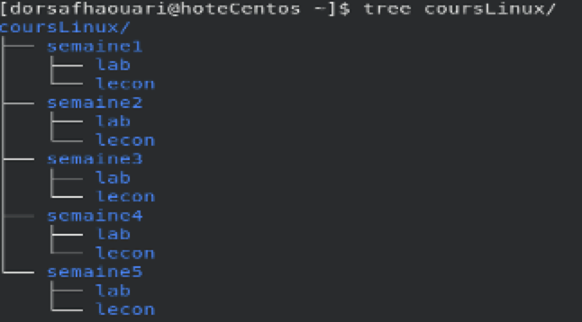

+++
title = "ATELIER #3: Cibles et variables utilisateurs et for"
weight = 32
+++

## Objectifs de l'atelier

- Se familiariser avec les cibles (niveaux d'exécution).
- Comprendre les bases des variables utilisateur en Bash.
- Apprendre à manipuler et utiliser des variables pour stocker des résultats de commandes.

## Format de la remise sur Moodle

{}
- Pour chaque exercice, vous devez prendre une **capture d'écran**. Sur les captures, on doit pouvoir voir :
  1. Votre nom d'utilisateur (Ne travaillez donc **pas** avec l'utilisateur `root`, ni la commande `sudo`).
  2. La ligne de commande et la commande.
  3. Le résultat de la commande. Si le résultat fait plus de 10 lignes, capturer juste les 10 premières lignes.
- Dans votre remise, l'enseignant/e doit pouvoir facilement identifier les captures d'écran et la question (de quel exercice) correspondante.
{}

---

# Atelier 

## Exercice 1 : Niveaux d'exécution

1. Modifier le niveau d'exécution par défaut de votre machine virtuelle (VM) pour passer en mode multi-utilisateurs sans interface graphique. 

2. Redémarrer la VM pour appliquer les changements à l'aide de la commande `shutdown -r now`.

3. Après le redémarrage, se connecter à votre VM . Vérifier que l'interface graphique ne démarre pas. Utiliser la commande `systemctl` pour connaître le niveau d'exécution actuel.

4. Rétablir le mode graphique par défaut. N'oubliez pas de redémarrer la VM pour que les changements soient pris en compte.

## Exercice 2 : Caractères génériques et commande *find*

1. Aller dans le répertoire `/etc`. **Notez qu'il est demandé de ne pas se déplacer pour le reste de cet exercice**.

2. Utiliser la commande `find` pour rechercher les fichiers dont le nom commence par la lettre `r` dans le répertoire courant.

3.  Utiliser la commande `find` pour rechercher les fichiers contenant la chaîne `rc` dans le répertoire courant.

4.  Utiliser la commande `find` pour rechercher les fichiers dont le nom comporte exactement trois caractères sur l'ensemble du système de fichiers (à partir de la racine).

## Exercice 3 : Expansion d'accolades et boucle *for*

{}
Assurez-vous d'être revenu dans votre répertoire personnel avant de commencer cet exercice.
{}

1. Utiliser l'expansion d'accolades pour créer l'arborescence de dossiers suivante en une seule commande.



2. Toujours en utilisant l'expansion d'accolades, créer un fichier vide nommé `priseNote` dans chaque répertoire `lab` en une seule commande

3. Utiliser une boucle `for` pour renommer tous les fichiers `priseNote` en `priseNote.txt`.

4. Utiliser une boucle `for` pour déplacer les fichiers `priseNote.txt` des répertoires `lab` vers les répertoires `lecon` correspondants.


{}
Utilisez la commande `tree` pour vérifier que l'arborescence des dossiers et les fichiers ont été créés et déplacés correctement. Par exemple :
```bash
$ tree lecon1
```
La structure qui devrait s'afficher :

```
lecon1
├── lab1
│   └── priseNote.txt
├── lab2
│   └── priseNote.txt
└── lab3
    └── priseNote.txt
```
{}


