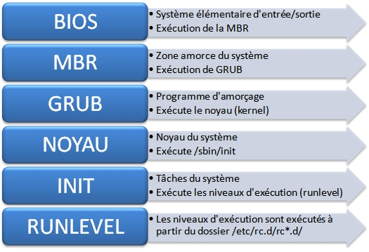

+++
title = "Processus de démarrage et le shell BASH"
weight = 41
+++

## La séquence de démarrage de Linux

Le processus de démarrage de Linux est une série d'étapes qui se déroulent depuis l'allumage de l'ordinateur jusqu'à l'affichage de l'invite de commande ou de l'interface graphique. Comprendre ce processus est essentiel pour diagnostiquer et résoudre les problèmes de démarrage. 



## 1. Le BIOS/UEFI

Le **BIOS** (*Basic Input/Output System*) ou l'UEFI (*Unified Extensible Firmware Interface*) est le premier programme qui s'exécute lorsque vous allumez votre ordinateur. Il initialise le matériel et recherche un périphérique de démarrage, tel qu'un disque dur ou une clé USB, contenant un chargeur de démarrage.

## 2. Le chargeur de démarrage (*Bootloader*)

Le **MBR** (*Master Boot Record*) est une petite section (512 octets) située sur le 1er secteur d'un disque dur. Il est essentiel pour que l'ordinateur sache comment démarrer et accéder aux différentes partitions du disque. Il contient des informations cruciales pour le démarrage de l'ordinateur, notamment :
- **Table de partition** : Indique comment le disque est divisé en partitions.
- **Code de démarrage** : Un petit programme qui charge le système d'exploitation ou un chargeur de démarrage plus avancé.

Le **chargeur de démarrage** est un programme qui charge le noyau Linux en mémoire et transfère le contrôle à celui-ci. Les chargeurs de démarrage les plus courants sont **GRUB** (*GRand Unified Bootloader*) et **LILO** (*LInux LOader*). 

- **GRUB** est le chargeur de démarrage le plus utilisé. Il permet de sélectionner différents noyaux ou systèmes d'exploitation à démarrer. Le fichier de configuration de GRUB est généralement situé dans `/boot/grub/grub.cfg`.
- **LILO** est un chargeur de démarrage plus ancien et moins utilisé que GRUB. Il est configuré via le fichier `/etc/lilo.conf`.

## 3. Le noyau Linux

Le noyau Linux est le cœur du système d'exploitation. Il initialise le matériel, monte le système de fichiers racine et lance le processus initial (`init` ou `systemd` selon la distribution).

- **Initialisation du matériel**: Le noyau détecte et initialise tous les périphériques matériels, tels que les disques durs, les cartes réseau et les périphériques USB.
- **Montage du système de fichiers racine**: Le noyau monte le système de fichiers racine, généralement situé sur le disque dur, pour accéder aux fichiers nécessaires au démarrage.

## 4. Le processus d'initialisation du système

Le processus d'initialisation est le premier processus lancé par le noyau et a toujours le PID (Process ID) 1. Il est responsable de démarrer tous les autres processus du système.

- ***SysVinit*** est un système d'initialisation traditionnel utilisé par de nombreuses distributions Linux. Il utilise des scripts d'initialisation situés dans `/etc/init.d/` pour démarrer les services.
- ***Systemd*** est un système d'initialisation moderne et largement adopté. Il utilise des unités de service (service units) définies dans des fichiers `.service` pour gérer les services. Les fichiers de configuration de `systemd` sont situés dans `/etc/systemd/system/`.

{}
- **Ubuntu** et **AlmaLinux** utilisent tous les deux `systemd` comme système d'initialisation par défaut (Ubuntu depuis la version 15.04). 
- Avec **Ubuntu** la commande `runlevel` est maintenue pour des raisons de compatibilité, mais elle peut ne pas toujours fonctionner correctement et afficher "unknown".
- Avec **AlmaLinux** les anciennes commandes d'initialisation comme `init` sont maintenues pour des raisons de compatibilités. `Systemd` inclut un lien symbolique vers `systemctl` pour les commandes `init`, ce qui permet aux utilisateurs de continuer à utiliser les commandes traditionnelles.
{}

## 5. Les cibles / niveaux d'exécution (*Runlevels*)

Dans le passé, sous Linux, les modes de fonctionnement étaient connus sous le nom de **niveaux d'exécution**, chacun permettant l'accès à un ensemble spécifique de services.
Cependant, avec l'introduction de `systemd` dans les distributions Linux modernes, le concept de niveaux d'exécution a été remplacé par celui de **cibles** (*target*). 

Néanmoins, l'ensemble des services associés aux anciens niveaux d'exécution ont été conservés dans le système de cibles de `systemd`, afin d'assurer une transition plus facile et de maintenir la compatibilité avec les scripts et les configurations existantes.

Les cibles (niveaux d'exécution) définissent l'état du système et les services qui doivent être exécutés. Les plus courants sont :

| Cible               | Niveau | Utilité                                         |
|---------------------|--------|-------------------------------------------------|
| poweroff.target     | 0      | Arrêt du système                                |
| rescue.target       | 1      | Mode mono-utilisateur (maintenance)             |
| multi-user.target   | 3      | Mode multi-utilisateur sans interface graphique |
| graphical.target    | 5      | Mode multi-utilisateur avec interface graphique |
| reboot.target       | 6      | Redémarrage du système                          |
| emergency           | --     | Shell d'urgence                                 |

### Le shell d'urgence

Le shell d'urgence (ou "emergency shell") est un environnement minimaliste de ligne de commande utilisé pour la récupération et la maintenance du système lorsque le démarrage normal échoue. Il est souvent invoqué lorsque le système rencontre des problèmes critiques, tels que des erreurs de montage du système de fichiers ou des problèmes de configuration.

#### Caractéristiques du Shell d'urgence

**Accès minimal** : Le shell d'urgence offre un accès limité aux commandes et aux utilitaires, mais il permet d'effectuer des tâches de dépannage essentielles.

**Mode lecture-écriture** : Le système de fichiers racine est généralement monté en mode lecture-écriture, permettant de modifier les fichiers de configuration et de réparer les erreurs.

**Pas de services** : La plupart des services et des démons ne sont pas démarrés, ce qui réduit les interférences et permet de se concentrer sur la résolution des problèmes.

### Les commandes pour la gestion des cibles

#### Lister les processus s’exécutant sur une machine

La commande `ps` affiche tous les processus s'exécutant sur une machine.
```bash
[ndesmangles@localhost ~]$ ps -ef
UID          PID    PPID  C STIME TTY          TIME CMD
root           1       0  2 16:18 ?        00:00:01 /usr/lib/systemd/systemd --s
root           2       0  0 16:18 ?        00:00:00 [kthreadd]
root           3       2  0 16:18 ?        00:00:00 [pool_workqueue_]
root           4       2  0 16:18 ?        00:00:00 [kworker/R-rcu_g]
root           5       2  0 16:18 ?        00:00:00 [kworker/R-rcu_p]

```

#### Utilisation de `runlevel`

La commande `runlevel` affiche le niveau d'exécution actuel.
```bash
[ndesmangles@localhost ~]$ runlevel
N 5
```

Cela signifie que le système est actuellement en niveau d'exécution 5 (mode graphique).

> [!IMPORTANT]
> Avec Ubuntu, au lieu d'utiliser la commande `runlevel`, utiliser `systemctl get-default`
```bash
nathalie@Yoda:~$ systemctl get-default
graphical.target
```

#### Utilisation de `init`

La commande `init` change le niveau d'exécution du système.

- Pour passer au niveau d'exécution 3 (mode multi-utilisateur sans interface graphique) :
  ```bash
  [ndesmangles@localhost ~]$ init 3
  ```
- Pour passer au niveau d'exécution 5 (mode multi-utilisateur avec interface graphique) :
  ```bash
  [ndesmangles@localhost ~]$ init 5
  ```
- Pour redémarrer le système (niveau d'exécution 6) :
  ```bash
  [ndesmangles@localhost ~]$ init 6
  ```

### Utilisation de `systemd`

Avec `systemd`, les cibles remplacent les niveaux d'exécution traditionnels. Voici quelques exemples de commandes `systemctl` pour gérer les cibles :

- **Changer de cible** :
  - Pour passer en mode multi-utilisateur sans interface graphique :
    ```bash
    [ndesmangles@localhost ~]$ systemctl isolate multi-user.target
    ```
  - Pour passer en mode multi-utilisateur avec interface graphique :
    ```bash
    [ndesmangles@localhost ~]$ systemctl isolate graphical.target
    ```

- **Définir la cible par défaut** :
  - Pour définir le mode multi-utilisateur avec interface graphique comme cible par défaut :
    ```bash
    [ndesmangles@localhost ~]$ systemctl set-default graphical.target
    ```
  - Pour définir le mode multi-utilisateur sans interface graphique comme cible par défaut :
    ```bash
    [ndesmangles@localhost ~]$ systemctl set-default multi-user.target
    ```

- **Vérifier la cible actuelle** :
  ```bash
  [ndesmangles@localhost ~]$ systemctl get-default
  graphical.target
  ```

- **Redémarrer et arrêter le système** :
  - Pour redémarrer le système :
    ```bash
    [ndesmangles@localhost ~]$ systemctl reboot
    ```
  - Pour arrêter le système :
    ```bash
    [ndesmangles@localhost ~]$ systemctl poweroff
    ```

## Le shell BASH

***BASH***, qui signifie *Bourne Again SHell*, est une version améliorée du *Bourne Shell*. Il a été développé pour offrir plus de fonctionnalités et une meilleure compatibilité avec les scripts existants. Voici quelques différences clés :

- **Compatibilité** : BASH est compatible avec les scripts du *Bourne Shell*, mais il offre également des fonctionnalités supplémentaires.
- **Fonctionnalités** : BASH inclut des fonctionnalités avancées comme l'édition de ligne de commande, l'historique des commandes, et le complétion automatique des noms de fichiers et des commandes.
- **Portabilité** : BASH est disponible sur de nombreux systèmes d'exploitation, y compris Linux, macOS, et Windows (via WSL).