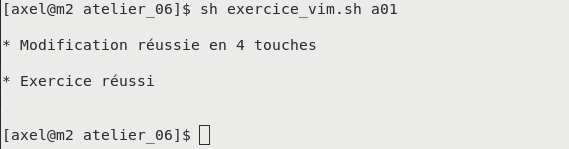

+++
title = "ATELIER #7: VIM et les fichiers de configuration"
weight = 72
+++

## Objectif de l'atelier

- Approfondir l’utilisation de VIM pour modifier des fichiers de configuration Linux de manière efficace.
1. **Modifier des fichiers de configuration Linux efficacement** :
   - Utiliser un minimum de touches.
   - **Ne pas utiliser la souris**.
2. **Compléter les exercices** :
   - **10 exercices** de type A (le curseur est déjà placé).
   - **5 exercices** de type B (le curseur commence au début du fichier).


## Instructions de remise

1. Fournissez les **captures d’écran** des exercices réussis via Moodle.
2. Chaque capture doit montrer :
   - La modification effectuée.
   - Le fichier sauvegardé dans l’état final.
3. Exemple de capture attendue :

   

4. Une vidéo de démonstration est disponible :

   <video width="50%" src="a01-2.webm" type="video/webm" autoplay loop muted></video>
---


# Atelier

## Préparation

### Installation des outils

1. Créez un fichier `vim.sh` avec le contenu suivant :

   ```bash
   #!/bin/bash

   wget https://linuxh25.netlify.app/semaine7/atelier/vimrc.dot || echo ERREUR
   mv vimrc.dot ~/.vimrc
   sudo yum install -y epel-release
   sudo yum install -y meld
   sudo yum groupinstall -y "Development Tools"
   sudo yum install -y git automake

   mkdir ~/tmp
   cd ~/tmp
   git clone https://github.com/kernc/logkeys.git
   cd logkeys
   ./autogen.sh

   cd build
   ../configure
   make
   sudo make install || echo ERREUR
   ```

2. Exécutez le script pour installer les outils requis :

   ```bash
   $ bash vim.sh
   ```

### Téléchargement des exercices

1. **Dans votre répertoire personnel** (`cd ~`), exécutez les commandes suivantes :

   ```bash
   $ cd ~
   $ wget https://linuxh25.netlify.app/semaine7/atelier/atelier_07.tar.gz || echo ERREUR
   $ tar zxvf atelier_07.tar.gz
   $ cd atelier_07
   ```
---

## Exercices de type A (curseur déjà placé)

{}
Ne pas éditer directement les vrais fichiers de configuration. Editer plutôt la copie qui se trouve dans le dossier `atelier_07` téléchargé
{} 

### Exercice a01

#### Fichier de configuration

`/etc/default/grub`

#### Modification à apporter

- **Avant** :

  ```php
  GRUB_CMDLINE_LINUX="rd.lvm.lv=centos/root rd.lvm.lv=centos/swap rhgb quiet"
  ```

- **Après** :

  ```php
  GRUB_CMDLINE_LINUX="rd.lvm.lv=centos/root rd.lvm.lv=centos/swap quiet"
  ```

  Supprimez `rhgb` pour désactiver le démarrage graphique.

#### Performances attendues

|   Record à battre   |  Maximum acceptable  |
|---------------------|----------------------|
| 4 touches           | 9 touches            |

#### Commandes pour lancer l’exercice

```bash
$ sh afficher_objectif.sh a01
$ sh exercice_vim.sh a01
```

---

### Exercice a02

#### Fichier de configuration

`/etc/selinux/config`

#### Modification à apporter

- **Avant** :

  ```php
  SELINUX=enforcing
  ```

- **Après** :

  ```php
  SELINUX=disabled
  ```

  Désactivez *SELinux*.

#### Performances attendues

| **Record à battre** | **Maximum acceptable** |
|-----------------------|-------------------------|
| 7 touches            | 25 touches             |

#### Commandes pour lancer l’exercice

```bash
$ sh afficher_objectif.sh a02
$ sh exercice_vim.sh a02
```

---


### Exercice a03

#### Fichier de configuration

`/etc/fstab`

1. Liste des partitions utilisées dans le système
1. Par défaut, chaque partition est montée au démarrage

#### Modification à apporter

**AVANT :**
```php
/dev/mapper/centos-tmp /tmp                     xfs     defaults        0 0
```
**APRÈS :**
1. En retirant une ligne, on efface la définition d'une partition
1. Le répertoire `/tmp` devient un sous-répertoire de `/` (partition `centos-root`)

#### Nombre de touches

| Record à battre | Maximum acceptable |
|----------------|------------------|
| 4 touches     | 6 touches        |

#### Pour visualiser avec *meld* et lancer l'exercice

```sh
$ sh afficher_objectif.sh a03
$ sh exercice_vim.sh a03
```

---

### Exercice a04

#### Fichier de configuration

`/etc/locale.conf`

1. Régionalisation du système: langue, date, etc.

#### Modification à apporter

**AVANT :**
```php
LC_TIME=""
```
**APRÈS :**
```php
LC_TIME="fr_CA.UTF-8"
```
1. On veut copier `fr_CA.UTF-8` entre les `"` afin de définir aussi le format de date.

#### Nombre de touches

| Record à battre | Maximum acceptable |
|----------------|------------------|
| 8 touches     | 18 touches        |

#### Pour visualiser avec *meld* et lancer l'exercice

```sh
$ sh afficher_objectif.sh a04
$ sh exercice_vim.sh a04
```

---

### Exercice a05

#### Fichier de configuration

`/etc/mime.types`

1. Définition des types de fichier et de leur extensions
1. **NOTE** : la commande `file` affiche le type d'un fichier

#### Modification à apporter

**AVANT :**
```php
application/3gpp-ims+xml
application/activemessage
application/andrew-inset
```
**APRÈS :**
```php
application/3gpp-ims+xml			inconnu
application/activemessage			inconnu
application/andrew-inset			inconnu
```
1. On ajoute l'extension `inconnu` pour les trois premiers types de fichier
1. **NOTE** : il y a trois tabulations entre le type et l'extension

#### Nombre de touches

| Record à battre | Maximum acceptable |
|----------------|------------------|
| 18 touches    | 40 touches       |

#### Pour visualiser avec *meld* et lancer l'exercice

```sh
$ sh afficher_objectif.sh a05
$ sh exercice_vim.sh a05
```

---

### Exercice a06

#### Fichier de configuration

`/etc/hosts`

1. Associe un nom réseau à son adresse
1. Pour ces noms, le système ne fera pas de requête DNS
1. **NOTE** : ce fichier existe aussi sous Windows

#### Modification à apporter

**AVANT :**
```php
206.167.24.30    ciboulot.ca
#172.17.0.30      ciboulot.ca
```
**APRÈS :**
```php
#206.167.24.30    ciboulot.ca
172.17.0.30      ciboulot.ca
```
1. On met en commentaire l'adresse publique de `ciboulot.ca`
1. On active l'adresse locale (seulement valide au Collège)

#### Nombre de touches

| Record à battre | Maximum acceptable |
|----------------|------------------|
| 6 touches     | 12 touches       |

#### Pour visualiser avec *meld* et lancer l'exercice

```sh
$ sh afficher_objectif.sh a06
$ sh exercice_vim.sh a06
```

---


### Exercice a07

#### Fichier de configuration

`/etc/firewalld/direct.xml`

1. Règles de pare-feu directes (écrites à la main).
2. **NOTE** : l'autre option est de générer les règles via la commande `firewall-cmd`.

#### Modification à apporter

**AVANT :**  

```xml
<rule priority="0" table="filter" ipv="ipv4" chain="FORWARD">-i PRIVE -o PUBLIC -j ACCEPT</rule>
<rule priority="0" table="filter" ipv="ipv4" chain="FORWARD">-i PUBLIC -o PRIVE -m state --state RELATED,ESTABLISHED -j ACCEPT</rule>
<rule priority="0" table="nat" ipv="ipv4" chain="POSTROUTING">-o PUBLIC -j MASQUERADE</rule>
```

**APRÈS :**  

```xml
<rule priority="0" table="filter" ipv="ipv4" chain="FORWARD">-i 192.168.1.4 -o 10.33.50.3 -j ACCEPT</rule>
<rule priority="0" table="filter" ipv="ipv4" chain="FORWARD">-i 10.33.50.3 -o 192.168.1.4 -m state --state RELATED,ESTABLISHED -j ACCEPT</rule>
<rule priority="0" table="nat" ipv="ipv4" chain="POSTROUTING">-o 10.33.50.3 -j MASQUERADE</rule>
```

1. On insère des vraies adresses IP à partir d'un patron.
2. **NOTE** : ces règles indiquent au système de faire du NAT.

#### Nombre de touches

| Record à battre | Maximum acceptable |
|----------------|-------------------|
| 37 touches    | 120 touches       |

#### Pour visualiser avec *meld* et lancer l'exercice

```sh
sh afficher_objectif.sh a07
sh exercice_vim.sh a07
```

---

### Exercice a08

#### Fichier de configuration

`~/.bashrc`

1. Personnalisation du SHELL.
2. Fichier lu à chaque ouverture du SHELL.

#### Modification à apporter

**AVANT :** *(Fichier initial vide ou sans alias spécifique)*  

**APRÈS :**  

```bash
alias la="ls -a"
```

1. On ajoute la ligne pour créer un alias.
2. **NOTE** : un alias est un raccourci pour une commande fréquemment utilisée.

#### Nombre de touches

| Record à battre | Maximum acceptable |
|----------------|-------------------|
| 12 touches    | 22 touches        |

#### Pour visualiser avec *meld* et lancer l'exercice

```sh
sh afficher_objectif.sh a08
sh exercice_vim.sh a08
```

---

### Exercice a09

#### Fichier de configuration

`/etc/resolv.conf`

1. Définit le ou les serveurs DNS à utiliser.

#### Modification à apporter

**AVANT :**  

```bash
nameserver 10.33.50.1
```

**APRÈS :**  

```bash
nameserver 192.168.1.1
```

1. On change l'adresse DNS à `192.168.1.1`.

#### Nombre de touches

| Record à battre | Maximum acceptable |
|----------------|-------------------|
| 14 touches    | 35 touches        |

#### Pour visualiser avec *meld* et lancer l'exercice

```sh
sh afficher_objectif.sh a09
sh exercice_vim.sh a09
```

---

### Exercice a10

#### Fichier de configuration

`/etc/ssh/sshd_config`

1. Configuration du serveur *SSH*.

#### Modification à apporter

**AVANT :**  

```bash
#X11Forwarding yes
```

**APRÈS :**  

```bash
X11Forwarding yes
```

1. Certaines options sont déjà inscrites dans le fichier.
   - Pour les activer, il suffit de les décommenter.
2. Ici, on active la redirection graphique.

#### Nombre de touches

| Record à battre | Maximum acceptable |
|----------------|-------------------|
| 3 touches     | 8 touches         |

#### Pour visualiser avec *meld* et lancer l'exercice

```sh
sh afficher_objectif.sh a10
sh exercice_vim.sh a10
```

---

## Exercices de type B (curseur au début du fichier)

{}
Ne pas éditer directement les vrais fichiers de configuration.
{}


### Exercice b01

#### Fichier de configuration

`/etc/ssh/sshd_config`

1. Configuration du serveur *SSH*

#### Modification à apporter

**AVANT :**

```php
#X11Forwarding yes
```

**APRÈS :**

```php
X11Forwarding yes
```

1. Même modification que `a10`, sauf que cette fois-ci le curseur n'est pas déjà placé

#### Nombre de touches

| Record à battre | Maximum acceptable |
|----------------|-------------------|
| 7 touches     | 18 touches        |

#### Pour visualiser avec meld et lancer l'exercice

```sh
$ sh afficher_objectif b01
$ sh exercice_vim.sh b01
```

---

### Exercice b02

#### Fichier de configuration

`/etc/default/grub`

- Configuration de `grub` (outil de démarrage)
- En particulier : options à donner au noyau Linux au démarrage

#### Modification à apporter

**AVANT :**

```php
GRUB_CMDLINE_LINUX="rd.lvm.lv=centos/root rd.lvm.lv=centos/swap rhgb quiet"
```

**APRÈS :**

```php
GRUB_CMDLINE_LINUX="rd.lvm.lv=centos/root rd.lvm.lv=centos/swap quiet"
```

1. Même modification que `a01`, sauf que le curseur n'est pas déjà placé

#### Nombre de touches

| Record à battre | Maximum acceptable |
|----------------|-------------------|
| 8 touches     | 20 touches        |

#### Pour visualiser avec *meld* et lancer l'exercice

```sh
$ sh afficher_objectif b02
$ sh exercice_vim.sh b02
```

---

### Exercice b03

#### Fichier de configuration

`/etc/services`

1. Liste des services réseau, protocoles et ports

#### Modification à apporter

**AVANT :**

```php
systat          11/tcp          users
systat          11/udp          users
daytime         13/tcp
daytime         13/udp
qotd            17/tcp          quote
qotd            17/udp          quote
msp             18/tcp                          # message send protocol (historic)
msp             18/udp                          # message send protocol (historic)
chargen         19/tcp          ttytst source
chargen         19/udp          ttytst source
ftp-data        20/tcp
```

**APRÈS :**

1. Effacer les services du port 11 jusqu'au port 20 (inclusif)

#### Nombre de touches

| Record à battre | Maximum acceptable |
|----------------|-------------------|
| 11 touches    | 28 touches        |

#### Pour visualiser avec *meld* et lancer l'exercice

```sh
$ sh afficher_objectif b03
$ sh exercice_vim.sh b03
```

---

### Exercice b04

#### Fichier de configuration

`/etc/passwd`

1. Information sur les usagers Linux

#### Modification à apporter

**AVANT :**

```php
gnome-initial-setup:x:984:977::/run/gnome-initial-setup/:/sbin/nologin
tcpdump:x:72:72::/:/sbin/nologin
avahi:x:70:70:Avahi mDNS/DNS-SD Stack:/var/run/avahi-daemon:/sbin/nologin
apache:x:48:48:Apache:/usr/share/httpd:/sbin/nologin
```

**APRÈS :**

1. On efface les 4 dernières lignes
1. **NOTE** : habituellement, ces lignes sont effacées par la commande `userdel`

#### Nombre de touches

| Record à battre | Maximum acceptable |
|----------------|-------------------|
| 6 touches     | 15 touches        |

#### Pour visualiser avec *meld* et lancer l'exercice

```sh
$ sh afficher_objectif b04
$ sh exercice_vim.sh b04
```

---

### Exercice b05

#### Fichier de configuration

`/etc/group`

1. Liste des groupes d'usagers Linux
1. Chaque usager est membre de son propre groupe
1. Un usager membre d'un autre groupe obtient des droits supplémentaires

#### Modification à apporter

**AVANT :**

```php
wheel:x:10:
```

**APRÈS :**

```php
wheel:x:10:mbergeron
```

1. On ajoute l'usager `mbergeron` au groupe `wheel`
1. Le groupe `wheel` est le groupe qui peut faire la commande `sudo`

#### Nombre de touches

| Record à battre | Maximum acceptable |
|----------------|-------------------|
| 10 touches    | 25 touches        |

#### Pour visualiser avec *meld* et lancer l'exercice

```sh
$ sh afficher_objectif b05
$ sh exercice_vim.sh b05
```
