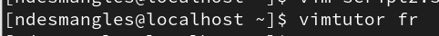

+++
title = "Vim et les fichiers de configuration"
weight = 71
+++

## L'éditeur de texte VIM

Dans les systèmes Linux, la majorité des configurations s’effectuent à l’aide de fichiers texte.

Pour modifier ces fichiers texte, nous utiliserons l'éditeur de texte **vim**. c'est un éditeur puissant avec de nombreux avantages :
- Disponible sur tous les systèmes basés sur UNIX,
- Très léger, idéal pour les systèmes sans interface graphique,
- Fonctionne en local ou à distance.

Apprendre à utiliser vim est indispensable pour travailler efficacement sous Linux.

### Tutoriels

1. Tutoriel directement sur VIM

2. Vidéo YouTube

   [Apprendre tout sur Vim](https://youtu.be/yfGbfZUzFq8?si=29JC21SMTF_Fur0l)

### Les principaux modes de VIM
 
vim propose 3 modes principaux pour travailler :

1. **Mode normal** (par défaut) :
   - Interprète les touches comme des commandes (ex. copier, supprimer, naviguer).
   - Utilisez la touche Échap (ESC) pour revenir à ce mode à tout moment.

2. **Mode visuel** :
   - Permet de sélectionner du texte.
   - Activez-le avec :
     - **v** : pour sélectionner des caractères,
     - **V** : pour sélectionner des lignes entières.

3. **Mode insertion** :
   - Permet d’ajouter ou modifier du texte.
   - Activez-le avec :
     - **i** : insérer à l’endroit du curseur.
     - **a** : insérer après le curseur.
     - **I** : insérer au début de la ligne.
     - **A** : insérer à la fin de la ligne.

### Navigation dans vim

Voici les principales commandes pour se déplacer rapidement :

| Action                      | Commande        |
|-----------------------------|-----------------|
| Un caractère à gauche       | `h`             |
| Un caractère à droite       | `l`             |
| Une ligne en bas            | `j`             |
| Une ligne en haut           | `k`             |
| Un mot à droite             | `w`             |
| Un mot à gauche             | `b`             |
| Début de la ligne           | `0`             |
| Fin de la ligne             | `$`             |
| Aller à une ligne précise   | `:numéro` (ex. `:100`) |

{}
Vous pouvez ajouter un quantificateur pour répéter une commande.
**Exemple** : `3w` pour avancer de 3 mots, `50j` pour descendre de 50 lignes.
{}

{}
Une virgule (`,`) sera considérée comme un mot.
{}

### Commandes de base

**1. Copier (commande y pour yank)** 

| À copier                   | Commande     |
|----------------------------|--------------|
| Une ligne                  | `yy`         |
| Jusqu’à la fin du mot      | `yw`         |
| Trois lignes               | `3yy`        |

**2. Coller (commande p ou P)**  

| Action                  | Commande  |
|-------------------------|-----------------|
| Coller après            | `p` minuscule   |
| Coller avant            | `P` majuscule   |

**Exemples avec Copier et Coller**

| Action                 | Commande     |
|------------------------|--------------|
| Copier 3 mots          | `y3w`        |
| Coller 3 fois          | `3p`         |

**3. Modifier du texte**

| Action                           | Commande     |
|----------------------------------|--------------|
| Remplacer un caractère           | `r` + (caractère) |
| Remplacer plusieurs caractères   | `R` (mode remplacement, taper jusqu’à `Échap`) |

**4. Annuler et répéter**  

| Action                            | Commande     |
|-----------------------------------|--------------|
| Annuler                           | `u` (undo)   |
| Répéter la dernière commande      | `.` (point)  |

**5. Supprimer du texte (couper)**

   a) Supprimer un caractère  

   |  Action                  |  Commande       |
   |--------------------------|-----------------|
   | Sous le curseur          | `x` minuscule   |
   | Avant le curseur         | `X` majuscule   |

   b) Autres suppressions  

   | Texte à supprimer             | Commande     |
   |-------------------------------|--------------|
   | Une ligne                     | `dd`         |
   | Jusqu’à la fin du mot         | `dw`         |
   | Jusqu’à la fin de la ligne    | `d$`         |

## Fichiers de configuration Linux

Sous Linux, les fichiers texte sont utilisés pour gérer la configuration des systèmes. Voici les fichiers les plus courants.

### Réseau  

|   Fichier            |   Rôle                                         |  Exemple                                    |
|----------------------|------------------------------------------------|---------------------------------------------|
| `/etc/resolv.conf`   | Configure les serveurs DNS                     | `nameserver 8.8.8.8`   `nameserver 8.8.4.4` |
| `/etc/hosts`         | Associe des noms de machine à des adresses IP  | `192.168.1.1 serveur1`                      |

### Personnalisation du shell  

|   Fichier       |   Rôle                                 |   Exemple                 |
|-----------------|----------------------------------------|---------------------------|
| `~/.bashrc`     | Permet de créer des alias pour simplifier les commandes | `alias lh="ls -lh"` |

### Autres fichiers utiles  

|   Fichier                       |   Rôle                                      |
|---------------------------------|---------------------------------------------|
| `/etc/selinux/config`           | Configure SELinux (sécurité).               |
| `/etc/passwd` et `/etc/group`   | Gèrent les utilisateurs et groupes.         |
| `/etc/locale.conf`              | Définit la langue du système.               |
| `/etc/fstab`                    | Configure le montage des partitions.        |
| `/etc/httpd/conf/httpd.conf`    | Configure le serveur Apache.                |
| `/etc/grub2.cfg`                | Configure le gestionnaire de démarrage.     |
