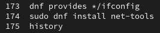

+++
title = "ATELIER #8: Dnf et Cron"
weight = 82
+++

## Objectifs de l'atelier

 - Installer des utilitaires et des applications avec ***dnf***.
 - Se familiariser avec ***cron***.  

---

# Atelier

## Partie 1 : Utilisation de dnf

### Paquets à installer  

| **Paquet** | **Description**                                                                                             | **Capture**            |
|-------------|-------------------------------------------------------------------------------------------------------------|------------------------|
| **Paquet 01**   | L'utilitaire `ifconfig` (ancêtre de `ip addr`).                                                              | `01_ifconfig.png`      |
| **Paquet 02**   | `Kmouth` (permet à l'ordinateur de parler pour des personnes muettes).                                       | `02_kmouth.png`        |
| **Paquet 03**   | Le langage de programmation `go`.                                                                            | `03_go.png`            |
| **Paquet 04**   | `ag`, un utilitaire rapide pour chercher dans des fichiers textes.                                           | `04_ag.png`            |
| **Paquet 05**   | Un outil pour visualiser l’espace disque utilisé.                                                            | `05_espace.png`        |
| **Paquet 06**   | Un lecteur de musique.                                                                                       | `06_musique.png`       |
| **Paquet 07**   | Un jeu de mémoire où il faut se souvenir de séquences de plus en plus longues.                               | `07_jeu.png`           |
| **Paquet 08**   | Une suite bureautique.                                                                                       | `08_bureautique.png`   |


### 1.1 Mise à jour des dépôts 

Avant toute installation, il est recommandé de s'assurer que votre système est à jour :

{}
Mettre à jour les dépôts ***dnf*** avec la commande:
```bash
sudo dnf update -y
```
{}

### 1.2 Installer le dépôt EPEL

Le dépôt **EPEL** (*Extra Packages for Enterprise Linux*) fournit des paquets additionnels utiles.

```bash
sudo dnf install epel-release -y
```

#### 1.2.1 Vérifier que le dépôt EPEL est activé

```bash
dnf repolist | grep epel
```

### 1.3 Installer le dépôt Remi

Le dépôt **Remi** est spécialisé dans les versions récentes de PHP et autres logiciels. 
  
```bash
sudo dnf install https://rpms.remirepo.net/enterprise/remi-release-9.rpm -y
```
*(Où **"9"** est la version de votre AlmaLinux.)*

#### 1.3.1 Activer le dépôt Remi 
 
```bash
sudo dnf config-manager --set-enabled remi
```

#### 1.3.2 Vérifier que le dépôt Remi est activé
  
```bash
dnf repolist | grep remi
```

### 1.4 Recherche des noms des paquets à installer

Pour chacun des paquets indiqués dans le tableau, rechercher le nom exact du paquet à l'aide d'une des commandes suivantes:

```bash
dnf search <nom_du_paquet>
```
ou
```bash
dnf search description_du_paquet
```
ou
```bash
dnf provides */nom_commande
```

### 1.5 Installer le paquet

```bash
sudo dnf install -y <nom_exact_du_paquet>
```

### 1.6 Commande *history* et capture d'écran pour la remise

Lancez la commande `history` et prenez une capture d'écran du résultat. 
```bash
history
``` 
Le résultat doit montrer au minimum:
 - La ou les commandes effectuées pour trouver le nom exact du paquet à installer
 - La commande effectuée pour installer le paquet
   
---

### Exemple (paquet 01)

Si vous essayez d'exécuter `ifconfig` mais que la commande n'est pas trouvée, vous pouvez chercher le paquet qui l'inclut avec la commande :
```bash
dnf provides */ifconfig
```

**Résultat possible** :
```yaml
net-tools-2.0-0.52.20160912git.el8.x86_64 : Basic networking tools
```
Cela indique que la commande `ifconfig` est fournie par le paquet `net-tools`.

{}
**x86_64** fait référence à l'architecture de processeur compatible avec les systèmes 64 bits. 
- **x86** : Terme historique qui désigne les processeurs compatibles avec l'architecture Intel x86 (originellement 16 bits, puis 32 bits avec les processeurs 80386 et suivants).
- **64** : Indique que le processeur peut traiter des données sur 64 bits, ce qui permet de gérer plus de mémoire (jusqu’à 16 exaoctets théoriques) et d’exécuter des calculs plus complexes en un seul cycle d’horloge.
{}

**Pour l'installer** :
```bash
sudo dnf install net-tools
```

**Historique des commandes** :
```bash
history
```


---

## Partie 2 : Expérimenter avec *cron*

### 2.1 Trouver la commande qui permet d'afficher l'heure actuelle [voir le cours de la semaine 2](http://linuxh25.netlify.app/semaine2/cours/#informations-système-et-historique)

### 2.2 Créer la tache

Vous devez créer une crontab (commande `crontab -e`) pour planifier une tâche qui exécutera la commande trouvée précédemment de façon **périodique**
- La tâche doit s'exécuter **à toutes les minutes** afin d’accumuler les relevés d’heures dans un fichier nommé **heures.txt**.

**Hint** : Redirigez le résultat de la commande (à exécuter périodiquement) dans le fichier **heures.txt**, sans écraser son contenu.

### 2.3 Sauvegarder et lancer la crontab

- Sauvegarder votre crontab (touches `Echap`, `:wq`)
- À l'aide de la commande `crontab -l` lancer la tâche.

### 2.4 Observer et suivre l'évolution du fichier heures.txt en temps réél.

Vous pouvez vérifier que le fichier **heures.txt** grossit à chaque minute à l'aide de la commande suivante:

```bash
tail -f heures.txt
```
Si votre tâche s'exécute correctement (au moins 2 heures s'affichent), vous devriez voir s'afficher dans la Terminal, l'heure actuelle, à chaque minute.

### 2.5 Désactiver la ligne *cron*

On ne veut pas continuer à accumuler du contenu dans **heures.txt** à chaque minute pour toujours.

<b><span style="color:red;">IMPORTANT</span></b> : Une fois satisfait que votre commande fonctionne, désactiver votre ligne *cron*.<br>
	- Par exemple, en la mettant en commentaire à l'aide du symbole `#`

### Remise 

- Capture d’écran de la ligne du crontab `crontab -l` (09_crontab.png),
- Le résultat du fichier **heures.txt** :
  - soit le fichier heures.txt
  - soit le résultat de la commande `tail -f heures.txt`