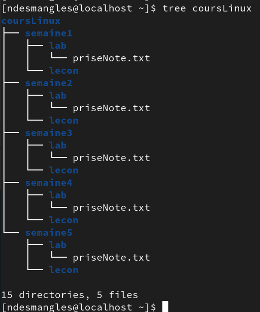

+++
title = "Atelier 3"
weight = 163
draft = true
+++

# Solution des exercices

---
## Exercice 1 : Niveaux d'exécution

1. Modifier le niveau d'exécution par **défaut** de votre machine virtuelle (VM) pour passer en mode multi-utilisateurs sans interface graphique. 
```bash
$ systemctl set-default multi-user
```

2. Redémarrer la VM pour appliquer les changements à l'aide de la commande `shutdown -r now`.
```bash
$ shutdown -r now
```

3. Après le redémarrage, se connecter à votre VM . Vérifier que l'interface graphique ne démarre pas. 
{}
Cela signifie qu'à la question #1, vous n'avez pas changé le mode **par défaut** (permanent), mais vous avez changé **temporairement** le mode en utilisant `isolate`. Le système étant configuré pour démarrer en mode graphique (`graphical.target`) par défaut, c'est lui qui reprend au redémarrage.
{}

Utiliser une commande `systemctl` pour connaître le niveau d'exécution actuel par défaut.
```bash
$ systemctl get-default
```

4. Rétablir le mode graphique par **défaut**. N'oubliez pas de redémarrer la VM pour que les changements soient pris en compte.
```bash
$ systemctl set-default graphical
```

## Exercice 2 : Caractères génériques et commande *find*

1. Aller dans le répertoire `/etc`. **Notez qu'il est demandé de ne pas se déplacer pour le reste de cet exercice**.
```bash
$ cd /etc
```

2. Utiliser la commande `find` pour rechercher les fichiers dont le nom commence par la lettre `r` dans le répertoire courant.
```bash
$ find . -name "r*"
```

3.  Utiliser la commande `find` pour rechercher les fichiers contenant la chaîne `rc` dans le répertoire courant.
```bash
$ find . -name "*rc*"
```

4.  Utiliser la commande `find` pour rechercher les fichiers dont le nom comporte exactement trois caractères sur l'ensemble du système de fichiers (à partir de la racine).
```bash
$ find / -name "???"
```

## Exercice 3 : Expansion d'accolades et boucle *for*

{}
Assurez-vous d'être revenu dans votre répertoire personnel avant de commencer cet exercice.
{}

```bash
$ cd ~
```

1. Utiliser l'expansion d'accolades pour créer l'arborescence de dossiers suivante en une seule commande.
```bash
$ mkdir -p coursLinux/semaine{1..5}/{lecon,lab}
$ tree coursLinux
```


2. Toujours en utilisant l'expansion d'accolades, créer un fichier vide nommé `priseNote` dans chaque répertoire `lab` en une seule commande.
```bash
$ touch coursLinux/semaine{1..5}/lab/priseNote
```


3. Utiliser une boucle `for` pour renommer tous les fichiers `priseNote` en `priseNote.txt`.
```bash
$ for i in coursLinux/semaine{1..5}/lab/priseNote; do mv "$i" "$i.txt"; done
```


4. Utiliser une boucle `for` pour déplacer les fichiers `priseNote.txt` des répertoires `lab` vers les répertoires `lecon` correspondants.  
```bash
$ for i in coursLinux/semaine{1..5}; do mv $i/lab/priseNote.txt  $i/lecon; done 
```
ou

```bash
$ for i in {1..5}; do mv ./coursLinux/semaine$i/lab/priseNote.txt ./coursLinux/semaine$i/lecon;done 
```

