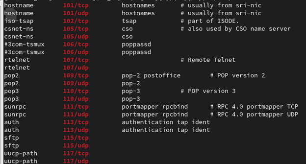
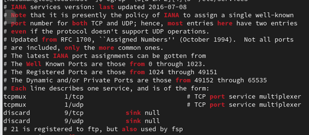
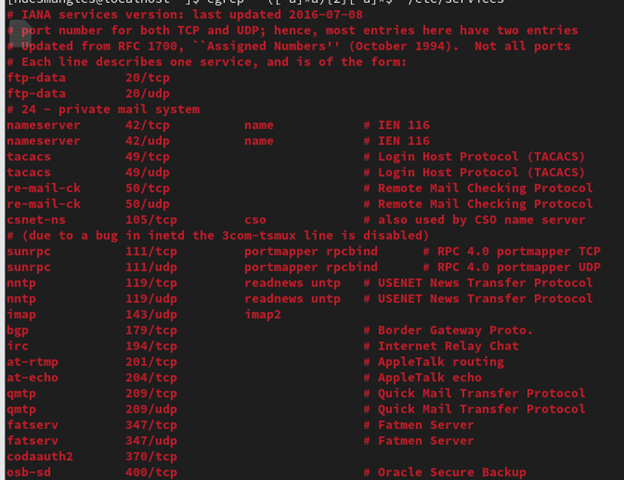
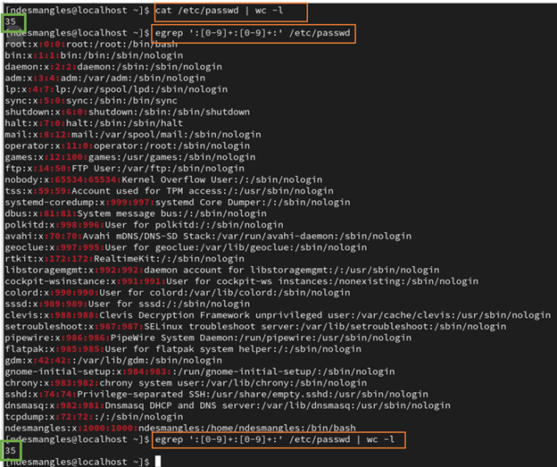
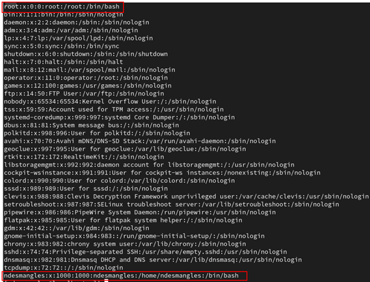

+++
title = "Atelier 6"
weight = 176
draft = true
+++

# Solutions des exercices

**Dans le fichier expr.txt:**

1. Trouver les codes postaux canadiens:
   - Format attendu : LettreChiffreLettreChiffreLettreChiffre.
     ```bash
     $ egrep '^[a-zA-Z][0-9][A-Z][0-9][a-zA-Z][0-9]$' expr.txt
     H6M2J4
     H4M4H4
     h4N2j5
     ```


2. Identifier les codes d’employés composés de :
   - Deux lettres majuscules suivies de quatre chiffres.
     ```bash
     $ egrep '^[A-Z]{2}[0-9]{4}$' expr.txt
     AB1234
     FC4355
     ```


3. Compter les lignes **ne se terminant pas** par une lettre :
   ```bash
   $ egrep '[^a-zA-Z]$' expr.txt | wc -l
   13
   ```

4. Identifier les numéros de téléphone :
    - Format : `(xxx)xxx-xxxx` ou `+1(xxx)xxx-xxxx`.
   ```bash
   $ egrep '\+1\([0-9]{3}\)[0-9]{3}-[0-9]{4}|\([0-9]{3}\)[0-9]{3}-[0-9]{4}' expr.txt
   (555)345-1234
   +1(819)654-0987
   ```

5. Trouver les URLs comme :
   - `http://www.domaine.tld` ou `http://www.domaine.tld/`
   - `https://www.domaine.tld` ou `https://www.domaine.tld/`

    ```bash
    $ egrep 'https?://(w){3}\.[a-zA-Z0-9.-]+\.[a-zA-Z]{2,6}/?' expr.txt
    http://www.domaine.qc.ca/
    https://www.domaine.qc.ca
    http://www.facebook.com
    https://www.google.ca
    ```

6. Rechercher des adresses e-mail :
   ```bash
   $ egrep '^[a-zA-Z0-9._%+-]+@[a-zA-Z0-9.-]+\.[a-zA-Z]{2,6}$' expr.txt
   toto_r@tutu.ca
   toto.titi@tutu.ca
   toto@tutu.qc.ca
   ```
---

**Dans le fichier `/etc/sercices`**

7. Trouver les lignes contenant "ssh" sans espace après.
   ```bash
   $ egrep 'ssh[^ ]' /etc/services
   x11-ssh-offset  6010/tcp                        # SSH X11 forwarding offset
   sshell          614/tcp                 # SSLshell
   sshell          614/udp                 #       SSLshell
   snmpssh-trap    5162/tcp                # SNMP Notification over SSH Transport Model
   ssh-mgmt        17235/tcp               # SSH Tectia Manager
   ssh-mgmt        17235/udp               # SSH Tectia Manager
   ```

8. Compter les lignes totales et celles non vides.
   - Total : 
   ```bash
   $ wc -l /etc/services
   11473 /etc/services
   ```
   - Non vides : 
   ```bash
   $ egrep -v '^$' /etc/services | wc -l
   11457
   ```

9. Trouver les lignes contenant soit `udp` soit `tcp` avec un numéro à trois chiffres.
   ```bash
   $ egrep '\s+[0-9]{3}/(udp|tcp)' /etc/services
   ```
   **début du résultat**
   

10. Rechercher les mots de quatre lettres entourés d'espaces.
   ```bash
   $ egrep '\s[a-zA-Z]{4}\s' /etc/services
   ```
   **début du résultat**
   

11. Identifier les mots avec exactement deux "a".
   ```bash
   $ egrep '^([^a]*a){2}[^a]*$' /etc/services.txt
   ```
   **début du résultat**
   

---

**Dans le fichier /etc/passwd**

12. **Assurez-vous que toutes les lignes dans `/etc/passwd` contiennent deux nombres entre ":" :**

   **résultat**
   

   
13. Compter les utilisateurs sans bash comme shell.
    ```bash
    $ egrep -v '/bash$' /etc/passwd | wc -l
    33
    ```
   