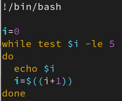

+++
title = "Test 2"
weight = 182
+++

{}
L'ordre des questions et des choix de réponses peut varier selon votre groupe.
{}  


#### **Question 1.** Quelle option de la commande *tree* permet d'afficher uniquement les répertoires ?
- [x] `-d` ✅ Bonne réponse
- [ ] `-L`
- [ ] `-r`
- [ ] `-f`


#### **Question 2.** Que signifie l'option *-i* avec la commande *sed* ?
- [x] Modifier un fichier sans créer de fichier temporaire ✅ Bonne réponse
- [ ] Afficher le contenu du fichier
- [ ] Rechercher du texte
- [ ] Extraire des colonnes


#### **Question 3**. Quelle commande permet de forcer l'arrêt d'un processus en utilisant son PID ?
- [ ] `kill <pid>`
- [ ] `killall -9`
- [ ] `kill bill`
- [x] `kill -9 <pid>` ✅ Bonne réponse


#### **Question 4.** Quelle commande permet d'afficher le PID du dernier processus lancé en arrière-plan ?
- [x] `$!` ✅ Bonne réponse
- [ ] `$$`
- [ ] `$?`


#### **Question 5.** Quelle commande permet d'afficher tous les processus en cours d'exécution sur le système ?
- [x] `ps -ef` ✅ Bonne réponse
- [ ] `ps -f`
- [ ] `pid`
- [ ] `ppid`


#### **Question 6.** Quelle commande permet d'extraire la 3ᵉ colonne d'un fichier en utilisant la virgule comme séparateur ?  
**Réponse** :  
```bash
cut -d, -f3
```


#### **Question 7.** Quelle commande permet de rechercher toutes les lignes contenant le mot 'erreur' dans le fichier 'log.txt' ?  
**Réponse** :  
```bash
grep 'erreur' log.txt
```


#### **Question 8.** Quelle commande permet d'extraire la 2ᵉ colonne d'un fichier 'data.txt' (séparé par des espaces) et de rechercher les lignes contenant 'valeur' ? 
**Réponse** :  
```bash
cut -d' ' -f2 data.txt | grep 'valeur'
```


### **Question 9.** Quelle option doit-on ajouter à la commande *sort* pour trier des nombres correctement ?
**Réponse** :  
```bash
-n
```


#### **Question 10.** Quel sera le résultat du code suivant (ne tenez pas compte de l'absence du # sur la première ligne) ?

- [ ] Une erreur 
- [ ] rien
- [ ] Les chiffres de 0 à 5 sur une ligne (horizontal)
- [x] Les chiffres de 0 à 5 sur une colonne (vertical) ✅ Bonne réponse


#### **Question 11.** Vous devez effectuer une recherche de tous les fichiers ".log" dans `/etc/`. Vous voulez aussi  enregistrer tous les résultats de la recherche, y compris les éventuelles erreurs de permission, dans un fichier nommé **"fichiers_log.txt"**. Quelle commande utilisez vous pour effectuer cette recherche et rediriger à la fois la sortie standard et les erreurs vers le fichier "fichiers_log.txt" ?<br>
**Réponse** :  
```bash
find /etc/ -name "*.log"> fichiers_log.txt 2>&1
```


#### **Question 12.** Dans le répertoire `/etc`, vous devez compter le nombre de fichiers dont le nom contient le mot "test", en redirigeant les erreurs de la commande vers "/dev/null" . Quelle commande utiliserez vous ?
**Réponse** :
```bash
find /etc/ -name " test " 2>/dev/null | wc -l
```


#### **Question 13.** 
- Écrivez un script **bash** qui crée trois fichiers nommés `file1.txt`, `file2.txt` et `file3.txt`.
- Après la création de chaque fichier, le script vérifie son existence avec la commande *test* et affiche un message confirmant la création.
- Utilisez une boucle `while` pour gérer la création des fichiers 
**Réponse** :  
```bash
#!/bin/bash

i=1

while test $i -le 3

do

   touch "file$i.txt"

   test -f "file$i.txt" && echo "file$i.txt créé avec succès."

   i=$((i + 1))

done
```


#### **Question 14.** En glissant les choix aux bons endroits, complétez le script Bash ci-dessous qui parcourt 3 fichiers simultanément et compte le nombre de mots.

{}
Les crochets dans la solution, représentent les cases que vous deviez remplir. Il ne s'agit pas des crochets commande test, ni des crochets dans les expressions régulières.
{} 
**Réponse** :  
```bash
[#!/bin/bash]

fichiers="fichier1.txt  fichier2.txt  fichier3.txt"

[for] f in $fichiers

do

    (

        [test] -e "$f" [&&] nb=$([wc ‑w] < "$f") [&&] 

        echo "Le fichier [$f] contient [$nb] mots." [|| ]

        echo "Le fichier [$f] n'existe pas."

    ) [&]

done

[wait]


echo "Tous les fichiers ont été traités."
```

##### Choix à caser :
- `#!/bin/bash`
- `for`
- `test`
- `&&`
- `wc -w`
- `$f`
- `$nb`
- `||`
- `&`
- `wait`

---

## Les incohérences dans vos réponses

**Mauvais délimiteur: deux-points au lieu de la virgule**
```bash
cut -d':' -f3
```

**Mauvaise option pour le délimiteur et/ou la colonne**
```bash
cut -k',' -t3
```

**Deuxième commande du pipeline `|` répéter le fichier**
```bash
cut -d' ' -f2 data.txt | grep 'valeur' data.txt
```

**Mauvaise logique: pipeline pas utilisé**
```bash
cut -d' ' -f2 data.txt && grep 'valeur'
```

**Mauvaise commande de recherche:** `grep` au lieu de `find`
```bash
grep /etc/ -name " test " 2>/dev/null | wc -l
```

**Absence du comptage de lignes**
```bash
find /etc/ -name " test " 2>/dev/null | wc -l
```

**Mauvais emplacement du comptage de ligne**
```bash
find /etc/ -name " test " | wc -l | 2>/dev/null 
```

**Logique erronée: Absence du pipeline**
```bash
find /etc/ -name " test " 2>/dev/null && wc -l
```

**Utilisation d'un chemin absolu `/`**
```bash
grep "erreur" /log.txt
```

**Réponses hors sujet**
```bash
sort -kn
```

```bash
-k2n
```

**Redirection des erreurs mal placée OU manquante**
```bash
find /etc/ -name "*.log" 2>&1 && fichiers_log.txt 
```

**Absence du caractère générique étoile**
```bash
find /etc/ -name ".log"> fichiers_log.txt 2>&1 
```


### script à coder

- Non respect des consignes: boucle `for` au lieu de `while`

- Absence de l'instruction **`#!/bin/bash`** sur la première ligne

- Compétence non acquise: Notion de boucle
```bash
while
   touch file1.txt
   touch file2.txt
   touch file3.txt
do
   test -e file1.txt
   test -e file2.txt
   test -e file3.txt
done

echo "Création du fichier à été confirmé."
```
- Structure du **`while`** incohérente: 
```bash
1. pas de variable de compte initialisée ou initialisée à 0 au lieu de 1

2. variable initialisée à 1, mais il y a des espaces 
i = 1

3. pas de condition après le while 
while X
do
   les commandes à répéter
done

4. mauvaise condition après le while
while read

5. une condition sans la commande test
while $i -le 3

6. mauvais opérateur de comparaison
while test $i -gt 3

```

- Syntaxes ou commandes pas vues en classe qui entrainent la note de 0**
```bash
[$i != 3] 
if
awk 
```


{}
Dans les prochains tests et ateliers voici les erreurs de la matière déjà vues en classe qui seront fortement pénalisées:

- Utilisation de syntaxe ou commandes pas déjà vue en classe 
- Utilisation d'une chemin absolu (`/`) rendant la commande erronée
- Utilisation de `grep` au lieu de `find` et vice versa
- Utilisation de `cat` ou `ls` au lieu de `grep` ou `find`
- Absence de pipeline ou remplacé par un opérateur logique (ex: &&)
- Si la redirection des erreurs, le chiffre 2 est absent
- Utilisation de `if...` si elle n'a pas déjà été vue en classe
- Utilisation des [ ] au lieu de la commande `test`
- Utilisation des [ ] des expressions régulières mais hors sujet
- Partie de la réponse hors sujet (ex: une commande de trop, une option de trop)
- Oublie des caractères génériques (exemple l'étoile)
- etc. des semaines 7 à 14

{}